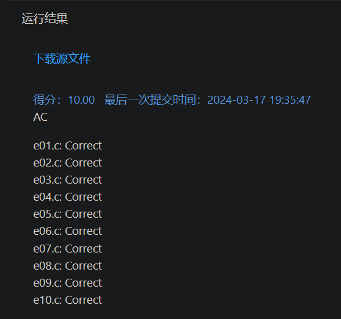

# Minimalist: More is Less[^0]

## 实验要求

初代编译器能够处理的文法如下所示：
关键字： int, return标识符：单个英文字母，如 a、 b 等
常量：十进制整型，如 1、 223、 10 等
操作符： =、 +、 -、 *、 /分隔符： ；
语句：表达式语句、赋值语句

## 实验分工

- 学理论知识，探索技术路线，幸好还没撞上南墙回头了。

- 根据 Scanner 来写 Parser（其实也进行干语义分析的活），绕过了 AST, Symbol Table, 乃至 Stack 等老大难（一开始不认真读题导致的）。

- 项目管理，文档撰写，资料查找，代码注释，救火队长。

## 实验设计

详细的请参见另一份文档以及源代码中的注释吧。

### 技术路线：

- Flex & Bison -> (LLVM?) 【尝试基于 flex & bison 里的 Simple Calculator，还未到带 AST, Symbol Table 等的 Advanced Calculator，被单文件吓倒，中道崩殂】
  
- Source Code $\xrightarrow{Scanner}$ Tokens $\xrightarrow{Parser}$ AST $\xrightarrow{Code\ Generator}$ Assembly 【照抄 https://github.com/DoctorWkt/acwj
 初号机速成单文件杂糅版，本欲小改加一个 return，函数太多，看不懂了，杀鸡用屠龙刀，中道崩殂】

- 基于嗯比较字符（串）的 Scanner，一边读一边转换成汇编。

### BNF: Backus-Naur Form

```C
expression: number
          | expression '*' expression
          | expression '/' expression
          | expression '+' expression
          | expression '-' expression
          ;
number:  CONSTANT
         ;

statements: statement
     | statement statements
     ;

statement: 'int'   identifier ';'
     |     'int'   identifier '=' expression ';'
     |     identifier '=' expression ';'
     |     'return' expression ';'
     ;

identifier: IDENTIFIER
      ;
```

### Constant Folding & Constant Propagation 

减少寄存器的操作

### x86 & MIPS

MIPS 对立即数的大小有限制

## 实验结果




## 实验反思

也参见首页的注释。

> Compiler construction is an exercise in engineering design. The compiler writer must choose a path through a design space that is filled with diverse alternatives, each with distinct costs, advantages, and complexity. Each decision has an impact on the resulting compiler. The quality of the end product depends on informed decisions at each step along the way. 编译器构建是一项工程设计活动。编译器开发者必须在充满多样选择的设计空间中选择一条路径，每个选择都具有不同的成本、优势和复杂性。每个决策都会影响最终的编译器。最终产品的质量取决于沿途每一步所做出的明智决策。[^1]


[^0]: Minimalist 是为了编译原理而学点生成文法时读的 *Syntactic Structures*(Noam Chomsky) 书里碰到的，附会一下最简方案或是什么极简主义。至于副标题，有句话叫 Less is More，还有句话叫 More is Different。这里的 More is Less 顶多是对前者的一个戏谑，本来还想看看能不能攀附上系统论，结果记错了。我在尝试前两个技术路线，以及从网上到处乱翻的时候儿，自己总是拗于用 C 写 C 的编译器，不要 C++，不要标准库，不要 STL…… 可能是有 Self-Contained 的意图，也可能是受到了编译器、系统、内核这类底层都该用 C 写的（错觉？）影响，觉得会影响性能会不够优雅，结果写出来的感觉更 dirty 了，暗合了印象里的某句“库和（自己写的）程序总要脏一个”。目前的程序，暴力、Dirty、C++、STL，应有尽有，投机取巧、未知的边界/特定条件、知道了也不用管的种种情形，但依托构思编程起来，确实大大地简化了。不敢说编写思路有多明晰，但读起来也算顺畅。
[^1]: Engineering a Compiler 3rd ed. Page xxii