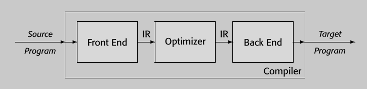
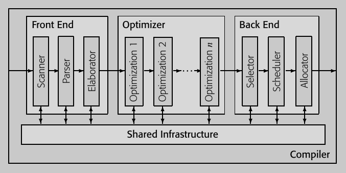
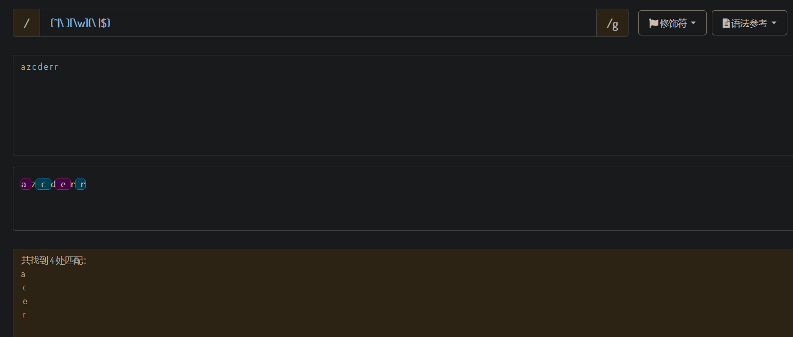

# Lab1-1st-Gen-Compiler 初代编译器[^1]

## 前言 🚧

> Compiler construction is an exercise in engineering design. The compiler writer must choose a path through a design space that is filled with diverse alternatives, each with distinct costs, advantages, and complexity. Each decision has an impact on the resulting compiler. The quality of the end product depends on informed decisions at each step along the way. 编译器构建是一项工程设计活动。编译器开发者必须在充满多样选择的设计空间中选择一条路径，每个选择都具有不同的成本、优势和复杂性。每个决策都会影响最终的编译器。最终产品的质量取决于沿途每一步所做出的明智决策。[^2]

> For the student, compiler construction is a capstone exercise that brings together elements from across computer science and applies them in a large design and implementation project. A good compiler makes practical use of greedy algorithms (register allocation), heuristic search techniques (list scheduling), graph algorithms (dead-code elimination), dynamic programming (instruction selection), automata theory (scanning and parsing), and fixed-point algorithms (data-flow analysis). It deals with problems such as dynamic allocation, synchronization, naming, locality, memory hierarchy management, and pipeline scheduling. Few other software systems bring together as many complex and diverse components. 对于学生来说，编译器构建是一项顶点练习，它汇集了计算机科学中的各个元素，并将它们应用于一个大型的设计与实现项目中。一个好的编译器实际上使用了贪心算法（寄存器分配）、启发式搜索技术（列表调度）、图算法（死代码消除）、动态规划（指令选择）、自动机理论（扫描与解析）以及固定点算法（数据流分析）。它处理的问题包括动态分配、同步、命名、局部性、内存层次管理和流水线调度。很少有其他软件系统能够集成这么多复杂且多样的组件。[^3]

## 结构 🚧

[^4]

[^5]

[^6]
[^7]

## 安排

## 工具

https://stackoverflow.com/questions/623503/what-is-the-difference-between-flex-lex-and-yacc-bison

### [Flex (scanner generator)](https://github.com/westes/flex/)

**The Fast Lexical Analyzer - scanner generator for lexing in C and C++**

**手册：https://westes.github.io/flex/manual/**

`flex` is a tool for generating *scanners*: programs which recognized lexical patterns in text. `flex` reads the given input files, or its standard input if no file names are given, for a description of a scanner to generate. The description is in the form of pairs of regular expressions and C code, called *rules*. `flex` generates as output a C source file, `` `lex.yy.c' ``, which defines a routine `` `yylex()' ``. This file is compiled and linked with the `` `-lfl' `` library to produce an executable. When the executable is run, it analyzes its input for occurrences of the regular expressions. Whenever it finds one, it executes the corresponding C code. [^8]

`flex`是一个用于生成*扫描器*的工具：这些程序能够识别文本中的词法模式。`flex`读取给定的输入文件，或者如果没有给定文件名，则读取其标准输入，以获取要生成的扫描器的描述。描述的形式是正则表达式和C代码的配对，称为*规则*。`flex`生成的输出是一个C源文件，`lex.yy.c`，该文件定义了一个`yylex()`函数。这个文件被编译和链接到`-lfl`库以产生一个可执行文件。当该可执行文件运行时，它分析其输入以查找正则表达式的出现。每当找到一个，就执行相应的C代码。


1. 首先，Flex 源程序中的规则被转换成状态转换图，生成对应的代码，包括核心的 `yylex()` 函数，保存在 `lex.yy.c` 文件中。Flex 源程序通常以 `.l` 为后缀，按照 Flex 语法编写，用于描述词法分析器。

2. 生成的 `lex.yy.c` 文件可以通过 C 编译为可执行文件。

3. 最终，可执行文件将输入流解析成一系列的标记/词例[^9]（tokens）。[^10]

### [GNU Bison (parser generator)](https://www.gnu.org/software/bison/)

**手册：https://www.gnu.org/software/bison/manual/**

*Bison* is a general-purpose parser generator that converts an annotated context-free grammar into a deterministic LR or generalized LR (GLR) parser employing LALR(1), IELR(1) or canonical LR(1) parser tables. Once you are proficient with Bison, you can use it to develop a wide range of language parsers, from those used in simple desk calculators to complex programming languages.[^11]

*Bison* 是一个通用的解析器生成器，它将带注释的上下文无关语法转换成使用LALR(1)、IELR(1)或规范LR(1)解析器表的确定性LR或广义LR(GLR)解析器。一旦你熟练掌握了Bison，你就可以使用它来开发各种范围的语言解析器，从用于简单桌面计算器的解析器到复杂的编程语言解析器。


Flex 和 Bison 是 Linux 下生成词法分析器和语法分析器的工具，用于处理结构化输入，协同工作解析复杂文件。Flex 将文本文件拆分为有意义的词法记号（token），而 Bison 根据语法规则生成抽象语法树（AST），Bison 在协同工作中担任主导角色，而 Flex 辅助生成 yylex 函数。[^12]

### [WinFlexBison - Flex and Bison for Microsoft Windows](https://github.com/lexxmark/winflexbison)

1. 于 https://github.com/lexxmark/winflexbison/releases 处下载 Flex 和 Bison 二者的Windows 移植可执行版本。 
2. 解压后即可在解压路径通过命令行执行 win_flex 或 win_bison。
3. 为方便在别处的使用，建议于系统环境变量的 Path 中添加解压后的路径。

### [LLVM](https://github.com/llvm/llvm-project)


## Scanner(Lexical Analysis, 词法分析)[^lex]

### Flex Matching is Greedy[^gre]

最长最先匹配规则。[^mat]

When the generated scanner is run, it analyzes its input looking for strings which match any of its patterns. If it finds more than one match, it takes the one matching the most text (for trailing context rules, this includes the length of the trailing part, even though it will then be returned to the input). If it finds two or more matches of the same length, the rule listed first in the `flex` input file is chosen.

当生成的扫描器运行时，它分析其输入，寻找与其任何模式匹配的字符串。如果它找到多于一个的匹配，它会选择匹配最多文本的那个（对于后续上下文规则，这包括后续部分的长度，尽管然后它会被返回到输入中）。如果它找到两个或更多长度相同的匹配，会选择在`flex`输入文件中首先列出的规则。


### noyywrap

lex 文件中需要添加此行：
```Flex
%option noyywrap
```

否则：
```Bash
C:\Users\dell\Documents\GitHub\Compiler_Construction\Lab1-1st-Gen-Compiler\src\Scanner>gcc lex.yy.c -o Scanner_Generated.exe
C:/Program Files/TDM-GCC-64/bin/../lib/gcc/x86_64-w64-mingw32/10.3.0/../../../../x86_64-w64-mingw32/bin/ld.exe: C:\Users\dell\AppData\Local\Temp\ccYjQcTm.o:lex.yy.c:(.text+0x543): undefined reference to `yywrap'
C:/Program Files/TDM-GCC-64/bin/../lib/gcc/x86_64-w64-mingw32/10.3.0/../../../../x86_64-w64-mingw32/bin/ld.exe: C:\Users\dell\AppData\Local\Temp\ccYjQcTm.o:lex.yy.c:(.text+0x114a): undefined reference to `yywrap'
collect2.exe: error: ld returned 1 exit status
```

### Flex 不支持 `\w` `\d`[^\d]

清单：https://westes.github.io/flex/manual/Patterns.html

In addition to characters and ranges of characters, character classes can also contain *character class expressions*. These are expressions enclosed inside ‘`[:`’ and ‘`:]`’ delimiters (which themselves must appear between the ‘`[`’ and ‘`]`’ of the character class. Other elements may occur inside the character class, too). The valid expressions are:

```Flex
    [:alnum:] [:alpha:] [:blank:]
    [:cntrl:] [:digit:] [:graph:]
    [:lower:] [:print:] [:punct:]
    [:space:] [:upper:] [:xdigit:]
```

These expressions all designate a set of characters equivalent to the corresponding standard C `isXXX` function. For example, ‘`[:alnum:]`’ designates those characters for which `isalnum()` returns true - i.e., any alphabetic or numeric character. Some systems don’t provide `isblank()`, so flex defines ‘`[:blank:]`’ as a blank or a tab.

### `[[:digit:]]`

非常愚蠢，但是使用 character classes 需要两层`[]`

否则你会得到： `[:digit:]` := `[: 或 d 或 i 或 g 或 t]`

### `\b`[^\b]

悬乎

```Flex
%{
#include <stdio.h>
%}

WC      [A-Za-z']
NW      [^A-Za-z']

%start      INW NIW

%%
{WC}  { BEGIN INW; REJECT; }
{NW}  { BEGIN NIW; REJECT; }

<INW>a { printf("'a' in word\n"); }
<NIW>a { printf("'a' not in word\n"); }

%%
```

This way I can do the equivalent of \B or \b at the beginning or end of any pattern. You can match at the end by doing `a/{WC}` or `a/{NW}`.

I wanted to set up the states without consuming any characters. The trick is using REJECT rather than yymore(), which I guess I didn't fully understand.

> But please note that Flex patterns do not capture groups like regular expressions, so the characters matched by `[^[:alpha:]]` or `^` and `$` (for start and end of line) are not "consumed" in a way that prevents them from being matched by subsequent rules. **⚠️ ChatGPT 4 生成（待考）**

但是，会有这样的结果：

`(^|\ )\[\[:alpha:]]\(\ |$)`



Silly of me!!!

我们要做的是分开匹配不同的东西，假如我把空格都给匹配了，就不用担心。。。了吗？（想复杂了）

### 零宽断言

> 此外，由于Flex处理的是字符流，而不是基于预先定义的正则表达式引擎，所以一些特定的正则表达式功能（如零宽断言）在Flex中可能难以直接实现。因此，设计Flex规则时通常需要采用更为直接的字符匹配和状态管理方式。
> 实际上，正确实现上述需求的Flex代码可能会更加复杂，涉及使用开始(`^`)和结束(`$`)匹配符号的条件，以及可能需要通过在动作代码中进一步处理匹配到的文本。在上述示例中，我简化了模式以便于说明，但在实践中，可能需要结合使用状态（start conditions）和更精细的模式匹配逻辑来准确捕获这些场景。
> 在Flex中，你无法直接创建一个规则，既检查前后的字符又不将这些字符作为匹配的一部分（即实现类似正则表达式的零宽断言）。但是，你可以通过编写规则和相应的动作代码来间接实现这个目的。 **⚠️ ChatGPT 4 生成（待考）**

一些个中文的相关讲解。

https://www.clarkok.com/blog/2015/04/06/Flex-匹配块级注释的正则表达式/

https://www.cnblogs.com/qqfontofweb/p/16597769.html

https://blog.csdn.net/w47_csdn/article/details/83507195

https://blog.51cto.com/u_15069442/3654241

http://www.blogjava.net/shisanfeng/articles/191396.html

You can probably achieve what you want with [start conditions](http://westes.github.io/flex/manual/Start-Conditions.html), at the cost of a more complicated scanner. Start conditions allow you to conditionally enable rules based on what has matched previously.

https://stackoverflow.com/questions/5615080/how-can-i-use-lookbehind-assertions-in-lex[](https://stackoverflow.com/posts/4756995/timeline)

You don't match C style comments with a simple regular expression in Flex; they require a more complex matching method based on start states. The [Flex FAQ](http://westes.github.io/flex/manual/How-can-I-match-C_002dstyle-comments_003f.html) says how (well, they do for the `/*...*/` form; handling the other form in just the `<INITIAL>` state should be simple).

https://stackoverflow.com/questions/4755956/unix-flex-regex-for-multi-line-comments

> 零宽断言的英文是 "zero-width assertion"。在正则表达式中，零宽断言允许我们对字符串中的字符进行位置上的断言，而不消耗任何字符（即不移动匹配指针）。这意味着零宽断言用于检查某个模式是否存在，而不会将该模式作为匹配结果的一部分。常见的零宽断言包括：
> * 零宽正向先行断言 (Positive Lookahead): `(?=pattern)`
> * 零宽负向先行断言 (Negative Lookahead): `(?!pattern)`
> * 零宽正向后发断言 (Positive Lookbehind): `(?<=pattern)`
> * 零宽负向后发断言 (Negative Lookbehind): `(?<!pattern)`
> Flex不支持零宽断言主要是因为Flex的设计初衷和实现方式。Flex是一个用于生成词法分析器的工具，其设计重点在于高效地从左到右扫描输入文本，逐个字符地匹配模式，并执行相应的动作代码。Flex的匹配机制基于最长匹配原则，即在给定位置上，它会尝试匹配最长的模式。
> 零宽断言是正则表达式中的一个高级特性，允许进行复杂的模式匹配，而不改变正在扫描的文本的当前位置。这种特性在某些正则表达式引擎中得到支持，特别是那些更侧重于字符串处理和模式搜索的引擎。然而，Flex作为一个词法分析器生成器，其目标是高效地执行简单的模式匹配并将输入文本转换为标记（token），而不是提供复杂的正则表达式处理能力。
> 因此，Flex的正则表达式支持相对简单，主要聚焦于满足词法分析过程中的需要，包括字符匹配、模式组合以及简单的条件分支，而不是提供完整的正则表达式引擎功能。这意味着一些正则表达式的高级特性，如零宽断言，不在Flex直接支持的范围内。 **⚠️ ChatGPT 4 生成（待考）**

> Flex在处理输入时遵循最长匹配原则，如果有多个规则都能匹配当前的输入，Flex会选择匹配最长字符串的规则。在上面的规则中，`int`作为一个完整的单词将优先匹配其对应的规则并返回`INT`，而像`integer`这样的字符串将被识别为`IDENTIFIER`。
> 通过这种方式，即使Flex本身不支持正则表达式中的零宽断言，你也能通过精心设计匹配规则来区分关键字和其他标识符。这个逻辑完全在Flex的词法分析阶段处理，而不需要借助Bison的语法分析功能。 **⚠️ ChatGPT 4 生成（待考）**
```C
"int"             { return INT; }
[a-zA-Z_][a-zA-Z0-9_]*   { return IDENTIFIER; }
```

😭😭😭完全想复杂了，既用不到零宽断言，也用不到 Start Conditions。 

> **Why do you assume you’re the smartest in the room? Soon that attitude may be your doom!**

### 引号"..."

Anything within the quotation marks is treated literally. Metacharacters other than C escape sequences lose their meaning. As a matter of style, it’s good practice to quote any punctuation characters intended to be matched literally.[^quo]

### [.cmd](https://stackoverflow.com/questions/148968/windows-batch-files-bat-vs-cmd)

### [Start Conditions](https://westes.github.io/flex/manual/Start-Conditions.html#Start-Conditions)

We also use a very powerful flex feature called *start states* that let us control which patterns can be matched when. [^sta]

### [Expressions](https://en.cppreference.com/w/c/language/expressions)

### [Token string and length](https://www.ibm.com/docs/en/zos/3.1.0?topic=translations-token-string-length)

### Definitions (Substitutions)[^sub]

## Parser(Syntactic Analysis, 句法分析)[^par]

## Elaborator(Semantic Analysis, 语义分析)[^ela]

### Clang 

After that you can use clang to compile C to mips assembly by doing something like:

```Bash
clang -target mipsel-linux-gnu foo.c -S -o -
```

which will compile the file "foo.c" to 32-bit mips assembly for the linux operating system and output it to the console.

https://stackoverflow.com/questions/41988604/c-code-to-mips-assembly-using-llvm

```Bash
main.c:1:9: fatal error: 'stdio.h' file not found
    1 | #include<stdio.h>
      |         ^~~~~~~~~
1 error generated.
```

https://stackoverflow.com/questions/48369566/clang-stdio-h-file-not-found

https://stackoverflow.com/questions/28758917/clang-clang-doesnt-find-c-c-headers-in-windows

**Clang doesn’t provide a stdio.h, it should come from your C standard library implementation, whatever that is**

https://discourse.llvm.org/t/fatal-error-stdio-h-file-not-found/65271/6

电脑上有 MinGW 有 GCC 可用，试着添到系统路径里。

```Bash
C:\Users\dell\Documents\GitHub\Compiler_Construction\Lab1-1st-Gen-Compiler\src>echo | gcc -E -Wp,-v -
ignoring duplicate directory "C:/Program Files/TDM-GCC-64/lib/gcc/../../lib/gcc/x86_64-w64-mingw32/10.3.0/include"
ignoring duplicate directory "C:/Program Files/TDM-GCC-64/lib/gcc/../../lib/gcc/x86_64-w64-mingw32/10.3.0/../../../../include"
ignoring duplicate directory "C:/Program Files/TDM-GCC-64/lib/gcc/../../lib/gcc/x86_64-w64-mingw32/10.3.0/include-fixed"
ignoring duplicate directory "C:/Program Files/TDM-GCC-64/lib/gcc/../../lib/gcc/x86_64-w64-mingw32/10.3.0/../../../../x86_64-w64-mingw32/include"
#include "..." search starts here:
#include <...> search starts here:
 C:/Program Files/TDM-GCC-64/bin/../lib/gcc/x86_64-w64-mingw32/10.3.0/include
 C:/Program Files/TDM-GCC-64/bin/../lib/gcc/x86_64-w64-mingw32/10.3.0/../../../../include
 C:/Program Files/TDM-GCC-64/bin/../lib/gcc/x86_64-w64-mingw32/10.3.0/include-fixed
 C:/Program Files/TDM-GCC-64/bin/../lib/gcc/x86_64-w64-mingw32/10.3.0/../../../../x86_64-w64-mingw32/include
End of search list.
# 1 "<stdin>"
# 1 "<built-in>"
# 1 "<command-line>"
# 1 "<stdin>"
ECHO is on.
```

https://stackoverflow.com/questions/4980819/what-are-the-gcc-default-include-directories

https://stackoverflow.com/questions/17939930/finding-out-what-the-gcc-include-path-is

添加到了 Path 里，未果。

尝试别的，添加到 CPATH 里。

> 至于你提到的直接在 Windows 的 `Path` 环境变量中添加路径，`Path` 环境变量是用来指定可执行文件的搜索路径，而不是编译器查找头文件的路径。添加路径到 `Path` 可以让系统知道从哪里找到可执行程序，但对于编译器寻找头文件则没有帮助。因此，如果你的目的是让编译器能够找到特定的头文件，你应该使用 `CPATH`（对于头文件的搜索）而不是 `Path` 环境变量。 **⚠️ ChatGPT 4 生成（待考）**

https://stackoverflow.com/questions/63782683/how-to-add-include-paths-to-clang-globally

https://clang.llvm.org/docs/CommandGuide/clang.html#envvar-C_INCLUDE_PATH,OBJC_INCLUDE_PATH,CPLUS_INCLUDE_PATH,OBJCPLUS_INCLUDE_PATH

https://superuser.com/questions/1717689/how-can-i-properly-configure-the-g-include-path-with-mingw64

http://gcc.gnu.org/onlinedocs/gcc/Environment-Variables.html

成功收获更多 errors & warnings

```Bash
C:\Program Files\TDM-GCC-64\x86_64-w64-mingw32\include\_mingw.h:272:2: error: Only Win32 target is supported!
  272 | #error Only Win32 target is supported!
      |  ^
In file included from main.c:1:
太多了，略
41 warnings and 6 errors generated.
```

### LLVM IR -> C

https://discuss.tvm.apache.org/t/possible-to-convert-a-llvm-ir-back-to-c-code/6625/5

Julia，别来无恙。

https://github.com/JuliaHubOSS/llvm-cbe

## 备忘


## 教程

[Flex(scanner)/Bison(parser)词法语法分析工作原理 - 知乎](https://zhuanlan.zhihu.com/p/120812270)

[Flex & Bison | 张东轩的博客](https://www.zhangdongxuan.com/2018/09/09/Flex-Bison/)

[flex&bison完成C-语言编译器前端（一） | desperadoccy的小窝](https://desperadoccy.xyz/2020/12/27/flex-bison/)

[flex与bison中文版.pdf](http://home.ustc.edu.cn/~guoxing/ebooks/flex%E4%B8%8Ebison%E4%B8%AD%E6%96%87%E7%89%88.pdf)

[flex & bison](https://web.iitd.ac.in/~sumeet/flex__bison.pdf)

[Flex and Bison Tutorial](https://www.cse.scu.edu/~m1wang/compiler/TutorialFlexBison.pdf)

[Tutorial Lex/Yacc](https://www.capsl.udel.edu/courses/cpeg421/2012/slides/Tutorial-Flex_Bison.pdf)

[Compiler Design](https://www.capsl.udel.edu/courses/cpeg421/2012/main.php?p=home)

[妮可 2014](http://staff.ustc.edu.cn/~bjhua/courses/compiler/2014/)

[妮可 2023](https://ustc-compiler-principles.github.io/2023/)

## 相关链接

[正则表达式在线测试](https://www.jyshare.com/front-end/854/)

[^1]: ~~日式转写：Shodai Konpa~~
[^2]: Engineering a Compiler 3rd ed. Page xxii
[^3]: 同上 Page 4
[^4]: 同上 Page 2
[^5]: 同上 Page 9
[^6]: https://github.com/DoctorWkt/acwj/blob/master/00_Introduction/Figs/parsing_steps.png
[^7]: https://www.tr0y.wang/2021/04/04/编译原理（四）：语义分析/
[^8]: https://ftp.gnu.org/old-gnu/Manuals/flex-2.5.4/html_node/flex_4.html
[^9]: 术语的中文翻译问题，参见：https://www.zhihu.com/question/39279003
[^10]: https://ustc-compiler-principles.github.io/2023/lab1/Flex/
[^11]: https://www.gnu.org/software/bison/manual/html_node/Introduction.html
[^12]: https://ustc-compiler-principles.github.io/2023/lab1/Bison/
[^lex]: **Scanner**, **Tokenizer**, **Lexer**: https://cboard.cprogramming.com/a-brief-history-of-cprogramming-com/110518-scanner-lexical-analyzer-tokenizer.html
[^mat]: [Flex and Bison Tutorial](https://www.capsl.udel.edu/courses/cpeg421/2012/slides/Tutorial-Flex_Bison.pdf) P17
[^\d]: https://stackoverflow.com/questions/22326399/flex-seems-do-not-support-a-regex-lookahead-assertion-the-fast-lex-analyzer
[^\b]: https://stackoverflow.com/questions/406985/implement-word-boundary-states-in-flex-lex-parser-generator
[^quo]: [flex & bison](https://web.iitd.ac.in/~sumeet/flex__bison.pdf) P20
[^sta]: [flex & bison](https://web.iitd.ac.in/~sumeet/flex__bison.pdf) P28 P136
[^sub]: [flex & bison](https://web.iitd.ac.in/~sumeet/flex__bison.pdf) P122
[^par]: 颇多用 syntax 修饰的，还有叫 Grammar Analysis 的, 讲道理 grammar 才是该译作“语法/文法”的。
[^ela]: http://staff.ustc.edu.cn/~bjhua/courses/compiler/2014/labs/lab2/index.html
[^gre]: https://westes.github.io/flex/manual/Matching.html
