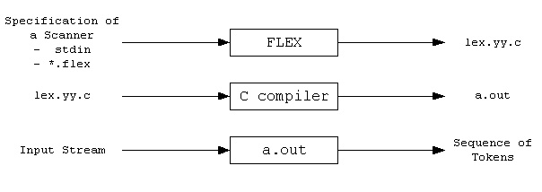
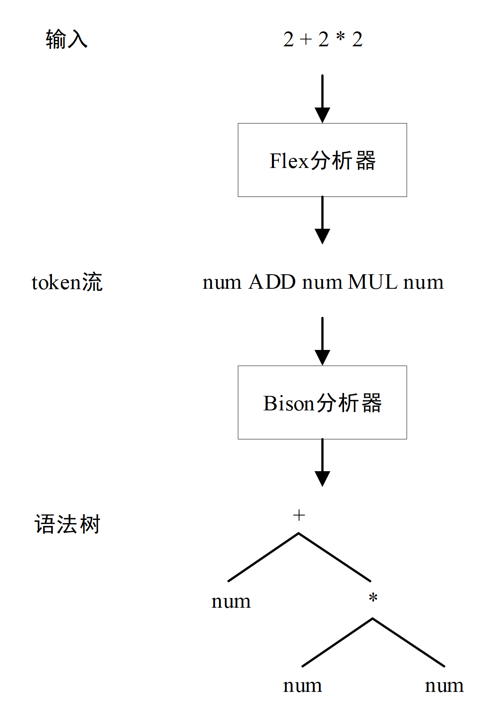

# Lab1-1st-Gen-Compiler 初代编译器[^1]

## 前言 🚧

> Compiler construction is an exercise in engineering design. The compiler writer must choose a path through a design space that is filled with diverse alternatives, each with distinct costs, advantages, and complexity. Each decision has an impact on the resulting compiler. The quality of the end product depends on informed decisions at each step along the way. 编译器构建是一项工程设计活动。编译器开发者必须在充满多样选择的设计空间中选择一条路径，每个选择都具有不同的成本、优势和复杂性。每个决策都会影响最终的编译器。最终产品的质量取决于沿途每一步所做出的明智决策。[^2]

> For the student, compiler construction is a capstone exercise that brings together elements from across computer science and applies them in a large design and implementation project. A good compiler makes practical use of greedy algorithms (register allocation), heuristic search techniques (list scheduling), graph algorithms (dead-code elimination), dynamic programming (instruction selection), automata theory (scanning and parsing), and fixed-point algorithms (data-flow analysis). It deals with problems such as dynamic allocation, synchronization, naming, locality, memory hierarchy management, and pipeline scheduling. Few other software systems bring together as many complex and diverse components. 对于学生来说，编译器构建是一项顶点练习，它汇集了计算机科学中的各个元素，并将它们应用于一个大型的设计与实现项目中。一个好的编译器实际上使用了贪心算法（寄存器分配）、启发式搜索技术（列表调度）、图算法（死代码消除）、动态规划（指令选择）、自动机理论（扫描与解析）以及固定点算法（数据流分析）。它处理的问题包括动态分配、同步、命名、局部性、内存层次管理和流水线调度。很少有其他软件系统能够集成这么多复杂且多样的组件。[^3]

## 结构 🚧

[^4]

[^5]

[^6]
[^7]

## 安排

## 工具

https://stackoverflow.com/questions/623503/what-is-the-difference-between-flex-lex-and-yacc-bison

### [Flex (scanner generator)](https://github.com/westes/flex/)

**The Fast Lexical Analyzer - scanner generator for lexing in C and C++**

**手册：https://westes.github.io/flex/manual/**

`flex` is a tool for generating *scanners*: programs which recognized lexical patterns in text. `flex` reads the given input files, or its standard input if no file names are given, for a description of a scanner to generate. The description is in the form of pairs of regular expressions and C code, called *rules*. `flex` generates as output a C source file, `` `lex.yy.c' ``, which defines a routine `` `yylex()' ``. This file is compiled and linked with the `` `-lfl' `` library to produce an executable. When the executable is run, it analyzes its input for occurrences of the regular expressions. Whenever it finds one, it executes the corresponding C code. [^8]

`flex`是一个用于生成*扫描器*的工具：这些程序能够识别文本中的词法模式。`flex`读取给定的输入文件，或者如果没有给定文件名，则读取其标准输入，以获取要生成的扫描器的描述。描述的形式是正则表达式和C代码的配对，称为*规则*。`flex`生成的输出是一个C源文件，`lex.yy.c`，该文件定义了一个`yylex()`函数。这个文件被编译和链接到`-lfl`库以产生一个可执行文件。当该可执行文件运行时，它分析其输入以查找正则表达式的出现。每当找到一个，就执行相应的C代码。



1. 首先，Flex 源程序中的规则被转换成状态转换图，生成对应的代码，包括核心的 `yylex()` 函数，保存在 `lex.yy.c` 文件中。Flex 源程序通常以 `.l` 为后缀，按照 Flex 语法编写，用于描述词法分析器。

2. 生成的 `lex.yy.c` 文件可以通过 C 编译为可执行文件。

3. 最终，可执行文件将输入流解析成一系列的标记/词例[^9]（tokens）。[^10]

### [GNU Bison (parser generator)](https://www.gnu.org/software/bison/)

**手册：https://www.gnu.org/software/bison/manual/**

*Bison* is a general-purpose parser generator that converts an annotated context-free grammar into a deterministic LR or generalized LR (GLR) parser employing LALR(1), IELR(1) or canonical LR(1) parser tables. Once you are proficient with Bison, you can use it to develop a wide range of language parsers, from those used in simple desk calculators to complex programming languages.[^11]

*Bison* 是一个通用的解析器生成器，它将带注释的上下文无关语法转换成使用LALR(1)、IELR(1)或规范LR(1)解析器表的确定性LR或广义LR(GLR)解析器。一旦你熟练掌握了Bison，你就可以使用它来开发各种范围的语言解析器，从用于简单桌面计算器的解析器到复杂的编程语言解析器。



Flex 和 Bison 是 Linux 下生成词法分析器和语法分析器的工具，用于处理结构化输入，协同工作解析复杂文件。Flex 将文本文件拆分为有意义的词法记号（token），而 Bison 根据语法规则生成抽象语法树（AST），Bison 在协同工作中担任主导角色，而 Flex 辅助生成 yylex 函数。[^12]

### [WinFlexBison - Flex and Bison for Microsoft Windows](https://github.com/lexxmark/winflexbison)

1. 于 https://github.com/lexxmark/winflexbison/releases 处下载 Flex 和 Bison 二者的Windows 移植可执行版本。 
2. 解压后即可在解压路径通过命令行执行 win_flex 或 win_bison。
3. 为方便在别处的使用，建议于系统环境变量的 Path 中添加解压后的路径。

## Scanner(Lexical Analysis, 词法分析)[^lex]

### Flex Matching is Greedy[^gre]

最长最先匹配规则。

[^mat]

When the generated scanner is run, it analyzes its input looking for strings which match any of its patterns. If it finds more than one match, it takes the one matching the most text (for trailing context rules, this includes the length of the trailing part, even though it will then be returned to the input). If it finds two or more matches of the same length, the rule listed first in the `flex` input file is chosen.

当生成的扫描器运行时，它分析其输入，寻找与其任何模式匹配的字符串。如果它找到多于一个的匹配，它会选择匹配最多文本的那个（对于后续上下文规则，这包括后续部分的长度，尽管然后它会被返回到输入中）。如果它找到两个或更多长度相同的匹配，会选择在`flex`输入文件中首先列出的规则。


### noyywrap

lex 文件中需要添加此行：
```Flex
%option noyywrap
```

否则：
```Bash
C:\Users\dell\Documents\GitHub\Compiler_Construction\Lab1-1st-Gen-Compiler\src\Scanner>gcc lex.yy.c -o Scanner_Generated.exe
C:/Program Files/TDM-GCC-64/bin/../lib/gcc/x86_64-w64-mingw32/10.3.0/../../../../x86_64-w64-mingw32/bin/ld.exe: C:\Users\dell\AppData\Local\Temp\ccYjQcTm.o:lex.yy.c:(.text+0x543): undefined reference to `yywrap'
C:/Program Files/TDM-GCC-64/bin/../lib/gcc/x86_64-w64-mingw32/10.3.0/../../../../x86_64-w64-mingw32/bin/ld.exe: C:\Users\dell\AppData\Local\Temp\ccYjQcTm.o:lex.yy.c:(.text+0x114a): undefined reference to `yywrap'
collect2.exe: error: ld returned 1 exit status
```

### Flex 不支持 `\w` `\d`[^\d]

清单：https://westes.github.io/flex/manual/Patterns.html

In addition to characters and ranges of characters, character classes can also contain *character class expressions*. These are expressions enclosed inside ‘`[:`’ and ‘`:]`’ delimiters (which themselves must appear between the ‘`[`’ and ‘`]`’ of the character class. Other elements may occur inside the character class, too). The valid expressions are:

```Flex
    [:alnum:] [:alpha:] [:blank:]
    [:cntrl:] [:digit:] [:graph:]
    [:lower:] [:print:] [:punct:]
    [:space:] [:upper:] [:xdigit:]
```

These expressions all designate a set of characters equivalent to the corresponding standard C `isXXX` function. For example, ‘`[:alnum:]`’ designates those characters for which `isalnum()` returns true - i.e., any alphabetic or numeric character. Some systems don’t provide `isblank()`, so flex defines ‘`[:blank:]`’ as a blank or a tab.

### `[[:digit:]]`

非常愚蠢，但是使用 character classes 需要两层`[]`

否则你会得到： `[:digit:]` := `[: 或 d 或 i 或 g 或 t]`

### `\b`

```Flex
%{
#include <stdio.h>
%}

WC      [A-Za-z']
NW      [^A-Za-z']

%start      INW NIW

%%
{WC}  { BEGIN INW; REJECT; }
{NW}  { BEGIN NIW; REJECT; }

<INW>a { printf("'a' in word\n"); }
<NIW>a { printf("'a' not in word\n"); }

%%
```


https://stackoverflow.com/questions/406985/implement-word-boundary-states-in-flex-lex-parser-generator

[Start Conditions](https://westes.github.io/flex/manual/Start-Conditions.html#Start-Conditions)


### [Expressions](https://en.cppreference.com/w/c/language/expressions)


## Parser(Syntactic Analysis, 句法分析)[^par]

## Elaborator(Semantic Analysis, 语义分析)[^ela]

## 备忘


## 教程

[Flex(scanner)/Bison(parser)词法语法分析工作原理 - 知乎](https://zhuanlan.zhihu.com/p/120812270)

[Flex & Bison | 张东轩的博客](https://www.zhangdongxuan.com/2018/09/09/Flex-Bison/)

[flex&bison完成C-语言编译器前端（一） | desperadoccy的小窝](https://desperadoccy.xyz/2020/12/27/flex-bison/)

[flex与bison中文版.pdf](http://home.ustc.edu.cn/~guoxing/ebooks/flex%E4%B8%8Ebison%E4%B8%AD%E6%96%87%E7%89%88.pdf)

[flex & bison](https://web.iitd.ac.in/~sumeet/flex__bison.pdf)

[Flex and Bison Tutorial](https://www.cse.scu.edu/~m1wang/compiler/TutorialFlexBison.pdf)

[Tutorial Lex/Yacc](https://www.capsl.udel.edu/courses/cpeg421/2012/slides/Tutorial-Flex_Bison.pdf)

[Compiler Design](https://www.capsl.udel.edu/courses/cpeg421/2012/main.php?p=home)

[妮可 2014](http://staff.ustc.edu.cn/~bjhua/courses/compiler/2014/)

[妮可 2023](https://ustc-compiler-principles.github.io/2023/)

## 相关链接

[正则表达式在线测试](https://www.jyshare.com/front-end/854/)

[^1]: ~~日式转写：Shodai Konpa~~
[^2]: Engineering a Compiler 3rd ed. Page xxii
[^3]: 同上 Page 4
[^4]: 同上 Page 2
[^5]: 同上 Page 9
[^6]: https://github.com/DoctorWkt/acwj/blob/master/00_Introduction/Figs/parsing_steps.png
[^7]: https://www.tr0y.wang/2021/04/04/编译原理（四）：语义分析/
[^8]: https://ftp.gnu.org/old-gnu/Manuals/flex-2.5.4/html_node/flex_4.html
[^9]: 术语的中文翻译问题，参见：https://www.zhihu.com/question/39279003
[^10]: https://ustc-compiler-principles.github.io/2023/lab1/Flex/
[^11]: https://www.gnu.org/software/bison/manual/html_node/Introduction.html
[^12]: https://ustc-compiler-principles.github.io/2023/lab1/Bison/
[^lex]: **Scanner**, **Tokenizer**, **Lexer**: https://cboard.cprogramming.com/a-brief-history-of-cprogramming-com/110518-scanner-lexical-analyzer-tokenizer.html
[^mat]: [Flex and Bison Tutorial](https://www.cse.scu.edu/~m1wang/compiler/TutorialFlexBison.pdf) P17
[^par]: 颇多用 syntax 修饰的，还有叫 Grammar Analysis 的, 讲道理 grammar 才是该译作“语法/文法”的。
[^ela]: http://staff.ustc.edu.cn/~bjhua/courses/compiler/2014/labs/lab2/index.html
[^gre]: https://westes.github.io/flex/manual/Matching.html
[^\d]: https://stackoverflow.com/questions/22326399/flex-seems-do-not-support-a-regex-lookahead-assertion-the-fast-lex-analyzer