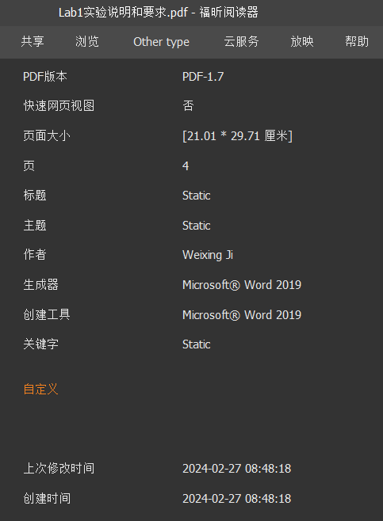
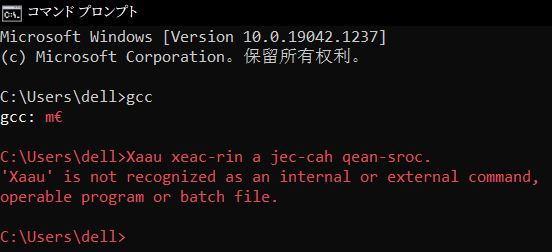
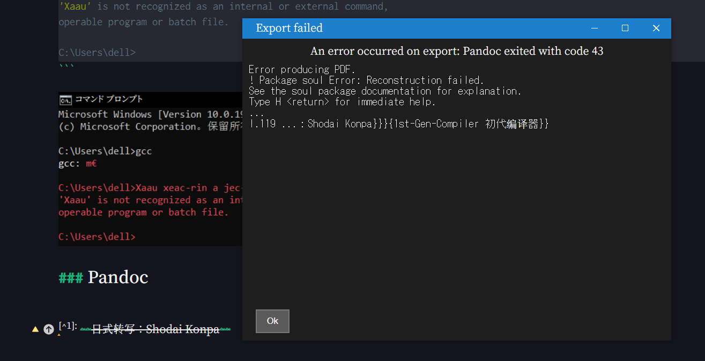

## 前人之述

往年 BNU 编译原理实验：

### 2019 年

C Minus Plus Plus (c-++), a C Minus Compiler with C Features, also a course project for BNU Compiler Theory (2019)

https://github.com/xk-huang/c-minus-plus-plus

### 2022 年秋：5 个实验

Teacher: Hua Luan 根据 https://github.com/Nofear12138/Principles-and-Techniques-of-Compilers 其中明确指出了来源：https://cs.nju.edu.cn/changxu/2_compiler/index.html

https://github.com/HaoyuLu1022/Principles-of-Compilers

- 词法分析
- 语法分析
- 语义分析
- 中间代码生成
- 目标代码生成

https://github.com/TheThirdSanta/BNU-Compilation_Principle_FOR_13thGroup 这个给了 4 次的。

https://github.com/Lacrimosa-minor/BNUAIComplieExp 这个给了 3 次的

## 牢骚

### 始作俑者


  嗯，大改。

### 强者如斯


## 偏题

### GCC

不是很懂 `gcc: m€` 是个什么。

```bash
Microsoft Windows [Version 10.0.19042.1237]
(c) Microsoft Corporation。保留所有权利。

C:\Users\dell>gcc
gcc: m€

C:\Users\dell>Xaau xeac-rin a jec-cah qean-sroc.
'Xaau' is not recognized as an internal or external command,
operable program or batch file.

C:\Users\dell>
```



### Pandoc

#### Package Soul Error (TODO)
Package Soul Error, when using the soul package (seems default in Pandoc) **together with ctex**, and when I use 删除线 ~~Latin OK, CJKV not.~~

`\usepackage{xeCJKfntef}`
`$\text{\sout{日式转写：Shodai Konpa}}$`

If I don't use `\text{}` outside, CJKVs just disappear (maybe cuz of Maths fonts)

If I use `\text{}`, Markdown WYSIWYG just goes wrong.


https://github.com/jgm/pandoc/issues/9019

This is a well known problem with `soul`, try the `soulutf8` package

https://tex.stackexchange.com/questions/536326/trouble-with-soul-and-utf8
