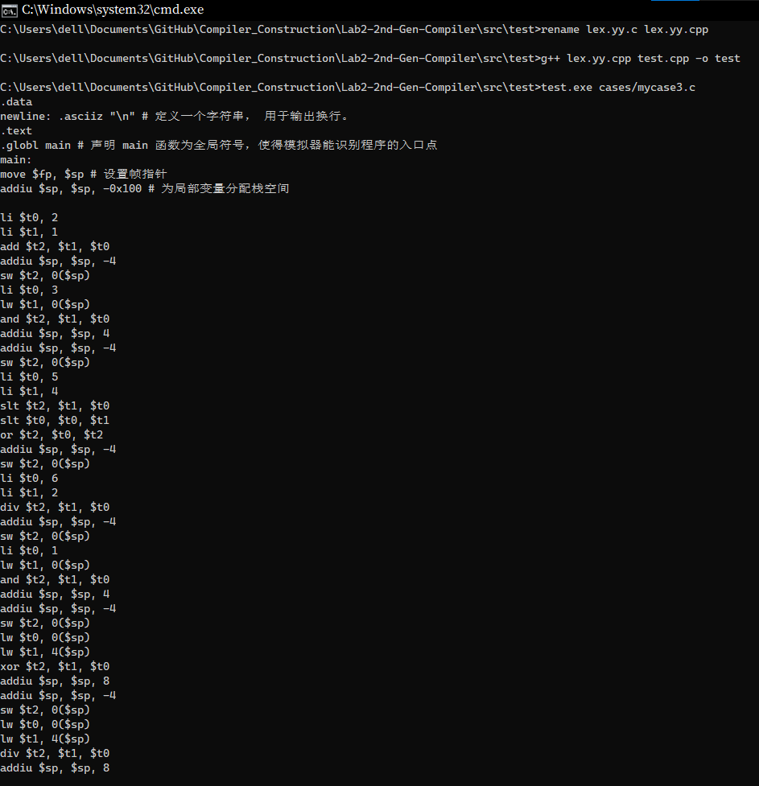

# 二代编译器

## 实验要求

二代编译器能够处理的文法如下所示。

- 关键字：`int`, `return`, `main`
- 标识符：符合 C89 标准的标识符（`[A-Za-z_][0-9A-Za-z_]*`）
- 常量：十进制整型，如 `1`、 `223`、 `10` 等
- 赋值操作符：`=`
- 运算符：`+ - * / % < <= > >= == != & | ^`
- 标点符号：`; { } ( )`
- 语句：
    - 变量声明（单变量且无初始化） `int a;`
    - 简单表达式赋值语句 `a = b&1;`
    - 复杂表达式3赋值语句（仅限等级二） `a = (d+b&1)/(e!=3^b/c&&d);`
    - return 语句 `return 0;`
    - 函数调用（只需支持预置函数） `println_int(a);`

## 实验分工

- 学理论知识，探索技术路线。

- 改造 Scanner 以衔接 Parser。

- 根据后缀表达式，优化生成汇编语言时变量的入栈出栈。

- 协助测试和代码注释。

- 改造 CMakeLists.txt，处理编译事宜。

- 项目管理，文档撰写，资料查找，救火队长。

## 实验设计

详细的还是请参见另一份文档以及源代码中的注释吧。

### 技术路线：

- Flex & Bison -> (LLVM?) 【尝试基于 flex & bison 里带 AST, Symbol Table 等的 Advanced Calculator，改造进展缓慢，希望下一实验用得上。】
  
- Source Code $\xrightarrow{Scanner}$ Tokens $\xrightarrow{Parser}$ AST $\xrightarrow{Code\ Generator}$ Assembly 【照抄 https://github.com/DoctorWkt/acwj 直到 06_Variables，现今能跑了，试图将部分代码迁移到到 Flex & Bison 路线，改造进展缓慢，希望下一实验用得上。】

- 利用 Flex 生成 Scanner，最初是读入代码后生成一个全是 Token.type:Token.value 的文件，供 Parser 读入分析，后省去中间这步文件读写，转为全部存入一个 TokenVector 中，再依次处理 Token 序列。首先是输出代码必须的 Preamble 部分，之后分成 Process_Declaration、 Process_Return、 Process_Println、 Process_Assignment 四种情形，进行相关操作如记录下变量名、查找变量位置，并生成对应语句的代码。最关键的是 Process_Assignment 当中的表达式赋值语句处理。

### Process_Assignment

此次由于要考虑运算优先级，未如同上次一样采用常量折叠、常量传播技术，而是首先将等号右侧的中缀表达式转换成了后缀表达式（仍然得到一个 `vector<Token>`），之后我们就可以正序遍历后缀表达式，根据不同 Token 做出判断。

起初我们将临时变量全部存放在寄存器中，通过取模递增的方式实现循环复用。但这并不能处理稍微复杂的表达式，比如有中间结果所在的寄存器要暂时予以保留，倘若数量较多，复用时可能会错误地将其覆盖。考虑到在处理汇编中，寄存器与栈的混用并不是一件特别容易的事情，参看（https://github.com/DoctorWkt/acwj/blob/master/54_Reg_Spills/Readme.md），因此我们采用了将中间结果全部放入栈中的操作，只在进行运算指令时将其载入特定的寄存器内，这种情况下，即便是寄存器所需数目最多的 `!=` 操作，也只需三个。

在遍历时，我们用一个 `stack<Token>` 存放运算符和运算数。除了操作符以外，我们碰到以下几种类型的操作数：作为标识符的 ID、作为常量的 Constant、作为临时变量的 TempID。每当计算出中间结果，便将其对应的两个操作数出栈，并将自身以 TempID 的形式入栈，以参与进一步的运算。

## 实验结果


由于 `h01.c` 并未给出，采用手工编写的一个样例 `mycase3.c`，用以展示其在处理表达式方面的正确性：

```c
int main()
{
	int a;
	a = (1+2&3)/(4!=5^2/6&1);
	return 0;
}
```



## 实验总结与反思

仍然在纠结到底怎么改造出一个 Flex + Bison + AST + Symbol Table 的一个像模像样的编译器，现阶段每次实验都能整出两三个不同路线的版本，而最后当成作业提交上去的版本往往是最暴力、最不优雅、最草率的一种方案，更优的路线则限于个人水平连抄带改都整不明白……大概，好事多磨吧。平常在时间规划和分工协作上其实也很有问题，这次实验报告就是拖到了最后关头，内容也没有写很多，改悔。