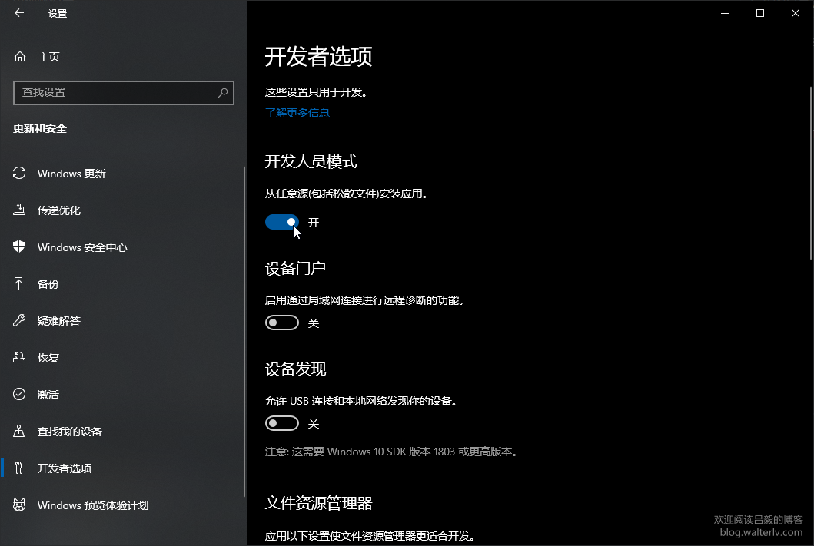

`Flex_Bison` 目录中的 `MyFlex.l`、`MyBison.y`，各自为 `Scanner`、`Parser` 下同名文件的符号链接。可以理解为在 `Flex_Bison` 内存放了两部分源代码的“快捷方式”，实际修改代码时，通过“快捷方式”和从原处进入编辑是等效的。

分开 `Scanner` 和 `Parser` 一是为了结构上的清晰，二是出于对之前代码的继承。

单另将两个“快捷方式”放在同一目录内是为了编译以及测试的便利。

`Scanner` 和 `Parser` 目录下的符号链接 `Declare.h` 均对应 `Flex_Bison` 中的 `Declare.h`，由于不确定编译器引用头文件时的路径，为稳妥起见而放。

> A symbolic link is a special type of file whose contents are a string that is the pathname of another file, the file to which the link refers. (The contents of a symbolic link can be read using readlink(2).)

So a symbolic link is one more file, just as a `README.md` or a `Makefile`. Git just stores the contents of the link (i.e. the aforementioned path of the file system object that it links to) in a 'blob' just like it would for any other file. It then stores the name, mode and type (including the fact that it is a symlink) in the tree object that represents its containing directory.

[How does Git handle symbolic links?](https://stackoverflow.com/questions/954560/how-does-git-handle-symbolic-links)

（Symlink 在两个不同系统上的兼容性仍有待测试。）

[Does Windows recognize Linux's symbolic links?](https://unix.stackexchange.com/questions/63172/does-windows-recognize-linuxs-symbolic-links)

Windows 上没有完全等效的 POSIX 符号链接，默认情况下，非管理员无法使用类似的链接，除非启用开发人员模式并使用相对较新的 Windows 10 版本。 因此，仅在检测到场景能够支持时，符号链接功能才会默认开启。 用户可以通过 core.symlinks=true 配置手动启用。

[Git 在 Windows 中管理符号链接](https://dora-cmon.github.io/posts/c866167c/)

`[坑1]`: 在微软的官方博客中已有说明：从 Windows 10 Insiders build 14972 开始，符号链接对开发者将不再需要管理员权限，这可以让开发者像在 Linux 或 macOS 上一样高效地工作。（通过如下图所示的开关来决定此操作是否需要管理员权限，打开则无需管理员权限。）

[比较 Windows 上四种不同的文件（夹）链接方式（NTFS 的硬链接、目录联接、符号链接，和大家熟知的快捷方式）](https://blog.walterlv.com/post/ntfs-link-comparisons.html)