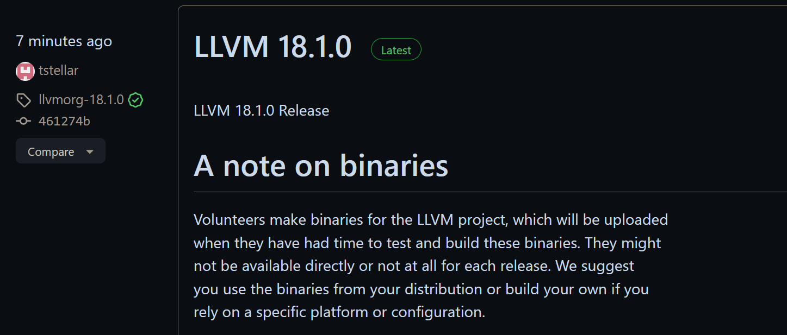

# Non-Stop!

## 前人之述

往年 BNU 编译原理实验：

### 2017 年

https://github.com/xuhongxu96/Compiler-Theory-Course

### 2019 年

C Minus Plus Plus (c-++), a C Minus Compiler with C Features, also a course project for BNU Compiler Theory (2019)

https://github.com/xk-huang/c-minus-plus-plus

### 2022 年秋：5 个实验

Teacher: Hua Luan 根据 https://github.com/Nofear12138/Principles-and-Techniques-of-Compilers 其中明确指出了来源：https://cs.nju.edu.cn/changxu/2_compiler/index.html

https://github.com/HaoyuLu1022/Principles-of-Compilers

- 词法分析
- 语法分析
- 语义分析
- 中间代码生成
- 目标代码生成

https://github.com/TheThirdSanta/BNU-Compilation_Principle_FOR_13thGroup 这个给了 4 次的。

https://github.com/Lacrimosa-minor/BNUAIComplieExp 这个给了 3 次的

### 2024 年春：

https://github.com/Amigomust/Compiler_Lab

## 牢骚

### 始作俑者


  嗯，大改。

### 强者如斯


### 幽默更新



## 知识

### BNF Grammars

*context-free grammar* (CFG)

CFGs are also known as *phrase-structure grammars* or *type-3 languages*. Computer theorists and natural language linguists independently developed them at about the same time in the late 1950s. If you’re a computer scientist, you usually call them CFGs, and if you’re a linguist, you usually call them PSGs or type-3, but they’re the same thing.

The standard form to write down a CFG is *Backus-Naur Form* (BNF).

`1 * 2 + 3 * 4 + 5`

```BNF
<exp> ::= <factor>
	  ! <exp> + <factor>
<factor> ::= NUMBER
	  ! <factor> * NUMBER
```

Each line is a *rule* that says how to create a branch of the parse tree. In BNF, ::= can be read “is a” or “becomes,” and | is “or,” another way to create a branch of the same kind. The name on the left side of a rule is a *symbol* or *term*. By convention, all tokens are considered to be symbols, but there are also symbols that are not tokens.


## 偏题

### GCC

不是很懂 `gcc: m€` 是个什么。

```bash
Microsoft Windows [Version 10.0.19042.1237]
(c) Microsoft Corporation。保留所有权利。

C:\Users\dell>gcc
gcc: m€

C:\Users\dell>Xaau xeac-rin a jec-cah qean-sroc.
'Xaau' is not recognized as an internal or external command,
operable program or batch file.

C:\Users\dell>
```


#### [Assembler error at @function](https://stackoverflow.com/questions/40445227/mingw32-assembler-error-at-function)


```
        .text                           # Preamble code
.LC0:
        .string "%d\n"                  # "%d\n" for printf()
printint:
        pushq   %rbp
        movq    %rsp, %rbp              # Set the frame pointer
        subq    $16, %rsp
        movl    %edi, -4(%rbp)
        movl    -4(%rbp), %eax          # Get the printint() argument
        movl    %eax, %esi
        leaq    .LC0(%rip), %rdi        # Get the pointer to "%d\n"
        movl    $0, %eax
        call    printf@PLT              # Call printf()
        nop
        leave                           # and return
        ret

        .globl  main
        .type   main, @function
main:
        pushq   %rbp
        movq    %rsp, %rbp              # Set the frame pointer
                                        # End of preamble code

        movq    $2, %r8                 # %r8 = 2
        movq    $3, %r9                 # %r9 = 3
        movq    $5, %r10                # %r10 = 5
        imulq   %r9, %r10               # %r10 = 3 * 5 = 15
        addq    %r8, %r10               # %r10 = 2 + 15 = 17
                                        # %r8 and %r9 are now free again
        movq    $8, %r8                 # %r8 = 8
        movq    $3, %r9                 # %r9 = 3
        movq    %r8,%rax
        cqo                             # Load dividend %rax with 8
        idivq   %r9                     # Divide by 3
        movq    %rax,%r8                # Store quotient in %r8, i.e. 2
        subq    %r8, %r10               # %r10 = 17 - 2 = 15
        movq    %r10, %rdi              # Copy 15 into %rdi in preparation
        call    printint                # to call printint()

        movl    $0, %eax                # Postamble: call exit(0)
        popq    %rbp
        ret
```

The form of `.type` directive used is specific to the ELF object format. You'll need to figure out what, if anything, would be the equivalent for Window's PECOFF object format.

Ok so the solution was really simple: just comment the .type directive. The PECOFF doesn't need that. Now I'm able to compile and run just fine.

#### [gcc -c option flag](https://www.rapidtables.com/code/linux/gcc/gcc-c.html)

*TL;DR:*

```bash
gcc out.s -o out.o
gcc out.o -o out.exe
```

駄目（だめ）：
```bash
gcc out.s -o out.exe
```

gcc -c compiles source files ***without*** linking.

https://stackoverflow.com/questions/14724315/what-does-the-c-option-do-in-gcc


https://www.jianshu.com/p/d850844f31da

> 把Wegame和CF卸载了重启电脑就好了。
这个问题困扰我一天，在百度搜各种方法。写篇小博客纪念一下，以后没CF了好好学习了。

幽默 CSDN [gcc报错16位应用程序解决办法](https://blog.csdn.net/weixin_45499478/article/details/107853438)

你应该与我一样是在windows上使用g++,gcc编译的程序,或者使用了mingw64的

然后请自己查看你的编译命令,差不多跟我一样:

```bash
gcc -O2 -Wall  -m64  -I./include -c main.c -o out/main.exe
```

那么,你的错误很常见也很明显: **去掉`-c`就好了**

* 去掉`-c`就好了
* 去掉`-c`就好了
* 去掉`-c`就好了

[mingw64 gcc g++ :不支持的 16 位应用程序](https://stackoverflow.com/questions/14724315/what-does-the-c-option-do-in-gcc)

### Multiple Definition

如果多个代码文件包含了同一个头文件，并且该头文件中定义了变量、函数等实体，而不仅仅是声明它们，那么在链接这些代码文件生成最终的可执行文件或库时，确实可能会遇到“multiple definition of...”错误。这是因为每个包含了该头文件的源文件都会尝试定义同一实体，从而在链接阶段造成冲突。

为了避免这种情况，通常采取以下策略：

1. **仅在头文件中声明变量和函数**：头文件应该用于声明变量（使用`extern`关键字）和函数原型，而将定义（实际的变量分配和函数实现）放在一个单独的源文件（.c或.cpp文件）中。这样，无论头文件被包含多少次，定义总是只存在一份。

2. **使用头文件保护**：为了避免头文件内容在同一个编译单元中被包含（插入）多次，可以使用预处理宏来防止这种情况。通常的做法是在头文件的开始使用`#ifndef`、`#define`和`#endif`指令来检查某个唯一的宏是否已定义，如果未定义，则定义它，并允许头文件内容的包含。如果该宏已定义，则跳过内容的包含。这称为“包含卫士”（include guard）或“头文件保护”。

例如：
```c
// Example.h
#ifndef EXAMPLE_H // 如果EXAMPLE_H未定义，则执行下面的代码
#define EXAMPLE_H

// 在这里声明函数和全局变量（使用extern）
extern int globalVariable;
void functionDeclaration();

#endif // EXAMPLE_H
```
然后，在一个源文件中定义这些变量和函数：
```c
// Example.c
#include "Example.h"

int globalVariable = 0; // 定义变量
void functionDeclaration() {
    // 函数实现
}
```
这样做可以确保即使多个源文件包含同一个头文件，每个变量或函数的定义只会出现一次，在链接时不会出现多重定义错误。

**⚠️ ChatGPT 4 生成（待考）**

#### 不治之症

[Assembly multiple definition](https://stackoverflow.com/questions/32855825/assembly-multiple-definition)

[Linking an assembler program: error "undefined reference to \`printf'"](https://stackoverflow.com/questions/34374591/linking-an-assembler-program-error-undefined-reference-to-printf)

[usr/bin/ld: cannot find -l\<nameOfTheLibrary>](https://stackoverflow.com/questions/16710047/usr-bin-ld-cannot-find-lnameofthelibrary)

[Error: /usr/bin/ld: final link failed: File truncated](https://stackoverflow.com/questions/20017091/error-usr-bin-ld-final-link-failed-file-truncated)

计算机系统导论lab1中的"multiple definition of", "first defined here"...

### Pandoc

#### Package Soul Error (TODO)
Package Soul Error, when using the soul package (seems default in Pandoc) **together with ctex**, and when I use 删除线 ~~Latin OK, CJKV not.~~

`\usepackage{xeCJKfntef}`
`$\text{\sout{日式转写：Shodai Konpa}}$`

If I don't use `\text{}` outside, CJKVs just disappear (maybe cuz of Maths fonts)

If I use `\text{}`, Markdown WYSIWYG just goes wrong.


https://github.com/jgm/pandoc/issues/9019

This is a well known problem with `soul`, try the `soulutf8` package

https://tex.stackexchange.com/questions/536326/trouble-with-soul-and-utf8
