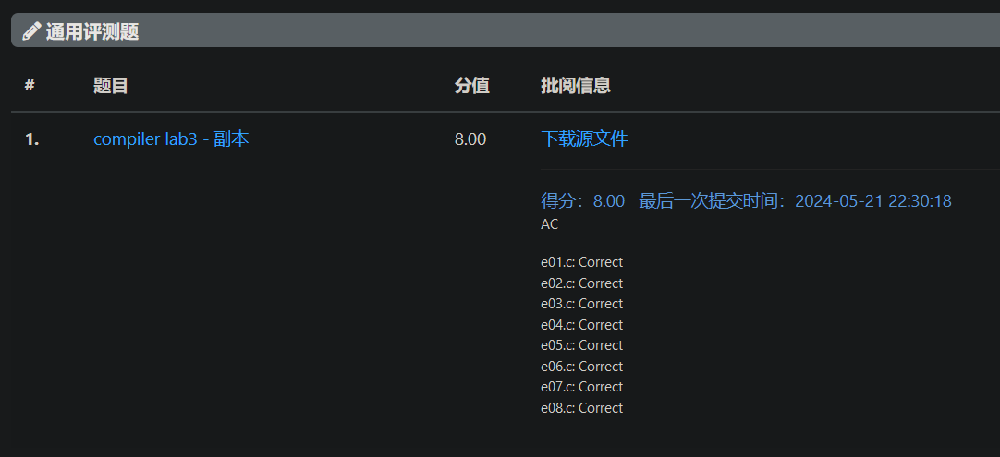

# 三代编译器

## 实验要求

三代编译器能够处理的文法如下所示。

- 关键字：`int`, `return`, `main`, `void`
- 标识符：符合 C89 标准的标识符（`[A-Za-z_][0-9A-Za-z_]*`）
- 常量：十进制整型，如 `1`、 `223`、 `10` 等
- 赋值操作符：`=`
- 运算符：
    - 一元运算符：`- ! ~`
    - 二元运算符：`+ - * / % < <= > >= == != & | ^ && ||`
- 标点符号：`; { } ( )`
- 语句：
    - 变量声明（多变量、初始化） `int a, b=111, c=1+3;`
    - 复杂表达式赋值语句  `a = (d+b&1)/(e!=3^b/c&&d); a = b+c;`
    - return 语句（可能为常数、变量、表达式） `return a+b; return func(a);`
    - 函数调用（只需支持预置函数） `println_int(a);`
- 函数定义：
    - 不带参数 `int func(){...}` `void func() {...}`
    - 带参数（可能为常数、变量、表达式） `int func(int a, int b){...}` `void func(int a, int b){...}`
- 预置函数：在自定义函数外，还需支持对预置函数的调用。
    - `println_int(int a)` 与 C 语言中 `printf("%d\n", a)` 有相同输出

## 实验分工

- 学理论知识，探索技术路线。

- 重构 Lab 2，包括编写 Bison、改造 acwj 框架并整合原有代码，实现了 Flex + Bison + AST + Symbol Table 的设想。

- 函数的声明（具体来讲是“定义”，不包括函数原型、隐式声明、非原型声明）、调用、代码生成。

- 形参、实参处理。

- 新增运算符的 Flex、Bison 部分及相关函数框架。

- 样例测试、代码注释。

- 改造 `CMakeLists.txt`，处理编译事宜。

- 项目管理，文档撰写，资料查找，救火队长。

## 实验设计

详细的还是请参见另一份文档以及源代码中的注释吧。

### 技术路线：

Source Code $\xrightarrow{Lexer}$ Tokens $\xrightarrow{Parser}$ Parse Tree (statements etc.) & AST (expressions) $\xrightarrow{Code\ Generator}$ Assembly Code

用 Flex 来写 Lexer，用 Bison 来写 Parser，Parser 与 Code Generator 相结合，对于一般语句可以直接生成代码，对于表达式会先构造抽象语法树（AST），再通过遍历结点生成代码。

### 源码结构：

代码的文件框架参考自 [Part 6: Variables](https://github.com/DoctorWkt/acwj/tree/master/06_Variables)，如下：

```Bash
src
├─ CMakeLists.txt					# CMake 编译用
├─ CMakeLists-评测用.txt					# CMake 评测用的简易版本，需改名
├─ MyBison.tab.c					# ⚠ 自动生成，无须手动修改
├─ MyBison.tab.h					# ⚠ 自动生成，无须手动修改
├─ MyBison.y		# Parser
├─ MyFlex.l		# Scanner/Lexer
├─ ast.cpp		# AST 结构
├─ build.sh						# Build on Linux
├─ cases						# 样例文件夹
│  ├─ e01.c
│  ├─ e02.c
│  ├─ e03.c
│  └─ e04.c
├─ codegen.cpp		# MIPS 代码生成，针对具体指令
├─ declare.h		# 头文件，声明各函数
├─ defs.h		# 头文件，定义一些复合类型数据
├─ gen.cpp		# 泛用代码生成
├─ lex.yy.c						# ⚠ 自动生成，无须手动修改
├─ main.cpp		# 主函数，程序入口
├─ run.cmd						# Build & Run on Windows
├─ stmt.cpp		# 语句相关代码生成
└─ symtab.cpp		# 符号表，变量、函数相关
```

©generated by [Project Tree Generator](https://woochanleee.github.io/project-tree-generator)

在从借鉴到改造 acwj 框架的过程中，各文件原本应有的良好的隔离性遭到了破坏，尤其 `codegen.cpp`, `gen.cpp`, `stmt.cpp` 在封装、调用上尚未打磨，分工多有重叠，有待改进。

### 抽象语法树（用于表达式）

```cpp
// defs.h

// Abstract Syntax Tree structure
struct ASTnode {
    int op;			// "Operation" to be performed on this tree
    struct ASTnode *left;		// Left and right child trees
    struct ASTnode *right;		// 若为 unary，则只有左子树。
    union {
        int intvalue;		// For A_INTLIT, the integer value
                        	// For A_IDENT, the symbol slot number
                            // For A_FUNC, the symbol slot number
    } v;
};
```

```cpp
// gen.cpp

// Given an AST, generate assembly code recursively.
void genAST(struct ASTnode *n) {

    // Get the left and right sub-tree values

    int offset = 0; // 给存放到栈内的中间变量分配的空间

    // 此处是从显式用栈的版本改造而来
    // 当初的代码是：
    // Token token1 = stack.top();stack.pop();
    // Token token2 = stack.top();stack.pop();
    // 则 n->left 对应 token2，n->right 对应 token1。

    // 尚不能合并，有待改进。
    if (n->left)
        genAST(n->left);
    if (n->right)
        genAST(n->right);
    
    if (n->left)
    {
        // 与处理右子树代码雷同，在此略去
        // 不过不用考虑 offset 非 0 的情况
        // ...
    }
    if (n->right)
    {
        switch (n->right->op) {
        case A_INTLIT:
            cout<<"li $t0, "<<n->right->v.intvalue<<endl;
            break;
        case A_IDENT:
            cout<<"lw $t0, "<<-4*n->right->v.intvalue<<"($fp)"<<endl;
            break;
        default:
            offset += 4;
            if(offset == 4)
                cout<<"lw $t0, 0($sp)"<<endl;
            else if(offset == 8)
                cout<<"lw $t0, 4($sp)"<<endl;
        }
    }

    switch (n->op)
    {
        case '+':
            cgadd();
            break;
        // 诸多算符，在此略去
        // 所用函数，基本位于 codegen.cpp
        // ...

        // 函数确实需要跟其他 op 一样将结果入栈
        case A_FUNC:
            // 总是有种把参数列表当作函数子树的想法，
            // 而实际上函数是叶子，offset 一直为 0
            // 所以不用担心“子树”位于栈中，
            // 应该能够用 cgfunccall 把入栈的操作处理好。
            arglist_output();
            cgfunccall(n->v.intvalue);
            return;
        case A_INTLIT:
            return;
        case A_IDENT:
            return;
        default:
            yyerror("Unknown AST operator");
    }

    if(offset)
        cout<<"addiu $sp, $sp, "<<offset<<endl;
    
    // 中间变量入栈
    cout<<"addiu $sp, $sp, -4"<<endl;
    cout<<"sw $t2, 0($sp)"<<endl;
}
```

### 符号表

参照 [Part 12: Types, part 1](https://github.com/DoctorWkt/acwj/tree/master/12_Types_pt1) 中的 *primitive types* 和 *structural types*，区分出 `type` 和 `stype`。

```cpp
// defs.h

// Primitive types
enum {
    P_INT, P_VOID
};

// Structural types
enum {
    S_VAR, S_FUNC
};
```

由此，我们将（局部）变量和函数统一视作 `symbol`，结构如下：

```cpp
// defs.h

struct symbol {
    std::string name;
    int type;
    int stype;

    // 构造函数 用以存入新的 symbol
    // 略
    
    // 重载小于运算符 提供给 map
    // 略
};
```

（局部）变量和函数各用一 `map<symbol, int>` 存放，将符号映为其位置。

重构 Lab2 时， `symbol` 中只有 `name`，使用 `unordered_map<string, int>` 存放可以提高查找效率。但 Lab3 中将 `string` 改为 `symbol` ，必须为 `unordered_map` 自定义散列函数，而使用 `map<symbol, int>` 则只需要重载 `<` 运算符。

```cpp
// symtab.cpp

static std::map<symbol, int> IDs;	// local symbol table
static std::map<symbol, int> FUNCs; // function table
```

并搭配（局部）变量和函数各自的存取查函数。

```cpp
// symtab.cpp

int findlocal(const char* name);
int addlocal(const char* name);
int addpara(const char* name, int para_num);
void clearlocal(void);						// 用于各函数代码生成后，其作用域中局部变量（含形参）的清理。
int findfunc(const char* name);
int functype(int value);
std::string funcname(int value);			// 用于 AST 中作为表达式的函数调用
int addfunc(const char* name, int type);
```

### 函数定义、局部变量与形参

我们仿照  [Variadic functions](http://en.wikipedia.org/wiki/Varargs.h#.3Cvarargs.h.3E) 中的 ellipsis，用（实际上在 C 中不合法的） `func(...)` 的形式来表示各函数，省去了参数，`func()` 仍用来表示无参数的情况。参考：[In a C function declaration, what does "..." as the last parameter do?](https://stackoverflow.com/questions/2735587/in-a-c-function-declaration-what-does-as-the-last-parameter-do)

#### 定义

Bison 中的规则，眼下是这么写的：

```cpp
// MyBison.y

int scope = 0; // 我们在此约定，scope = 0 是 func， scope = 1 是 main。

procedure   : VOID ID '(' { scope = 0; genfuncpreamble($2, P_VOID); } ')' '{' stmts '}'          {genfuncpostamble();}
            | VOID ID '(' { scope = 0; genfuncpreamble($2, P_VOID); para_num = 0; } paralist ')' '{' stmts '}' {genfuncpostamble();}
            | INT ID '(' { scope = 0; genfuncpreamble($2, P_INT); } ')' '{' stmts '}'            {genfuncpostamble();}
            | INT ID '(' { scope = 0; genfuncpreamble($2, P_INT); para_num = 0; } paralist ')' '{' stmts '}'   {genfuncpostamble();}
            | INT MAIN '(' ')' { scope = 1; genmainpreamble(); } '{' stmts '}'   {}
            | INT MAIN '(' INT ID ',' INT ID ')' { scope = 1; genmainpreamble(); addlocal($8); addlocal($5); } '{' stmts '}' {}
;
```

首先，各类型如 `void`，`int` 尚分属不同的 token。今后增加类型，Flex 文件可以改为：

```cpp
// MyFlex.l

"void"	{ yylval.fn = 1; return TYPE; }
"int"	{ yylval.fn = 2; return TYPE; }
"char"	{ yylval.fn = 3; return TYPE; }
// ...
```

其次，`ID` 和 `MAIN` 是分开的。我们暂不考虑主函数遭调用的情况，则其 preamble 中无须保存`$fp`和`$ra`，也用不着 postamble，故作出区分。注意，对 `scope` 赋予不同值也是为了区别处理 `return(...)` 语句，有些多余了。

目前 `paralist` 不含空参数的情况，故将无参数与有参数强行分开，之后应当改写。

#### 局部变量

Bison 中局部变量声明和赋值部分的规则：

```cpp
// MyBison.y

declarations : INT identifier               {}
            | declarations ',' identifier   {}
;

identifier  : ID            { var_declaration($1); }
            | ID '=' exp    { var_declaration($1); assignment_statement($1, $3); }
;

stmt : declarations ';'     {}
     | ID '=' exp ';'       { assignment_statement($1, $3); }
     // ...
;
```

```cpp
// stmt.cpp

// Parse the declaration of a variable
void var_declaration(const char* name) {
    addlocal(name);
}
```

局部变量按照在当前函数中声明的次序添加到 `IDs` 中。注意，我们将局部变量全部存放在栈中，而没有使用 `$s0 - $s7` 寄存器，其中第 n 个声明的局部变量，其 `second` 值为 n，对应地址为 `$fp - n * word`，生成代码时取负并乘上字长即可。
```cpp
// symtab.cpp

static std::map<symbol, int> IDs;	// local symbol table
static int Index = 0;       // 统计变量个数，便于栈操作。

// Add a local symbol to the symbol table.
// Return the slot number in the symbol table
int addlocal(std::string name, int type, int stype) {
    int y;

    // If this is already in the symbol table, return the existing slot
    if ((y = findlocal(name)) != -1)
        return (y);

    // Otherwise get a new slot, fill it in and
    // return the slot number
    y = newlocal(); // y = (++Index)
    IDs[symbol(name, type, stype)] = y;
    return (y);
}
```

注意，每次 `genfuncpreamble(...)` 或是 `genmainpreamble()` 时，都会先清空 `IDs` 并清零（局部）变量的个数 `Index`，并为局部变量分配栈空间，以此来模拟各函数作用域/生命周期。

#### 形参

暂不考虑形参初始赋值。

```cpp
// MyBison.y

int para_num = 0; // 方便 para_declaration

// e.g. int a, int b, int c, int d
paralist : INT ID { para_num++; para_declaration($2, para_num); }
         | paralist ',' INT ID { para_num++; para_declaration($4, para_num); } // 左递归
         // 声明顺序：a, b, c, d
;
```

`para_num` 用来记录当前形参是该列表中的第几个，处理每个列表前，我们会先将 `para_num` 设为 0，之后递增。

```cpp
// stmt.cpp

void para_declaration(const char* name, int para_num) {
    addpara(name, para_num);
}
```

我们将形参视作一种特殊的局部变量，同样是存放在栈中，而没有使用寄存器 `$a0 - $a3`。 考虑到形参地址始于 `$fp + 2 * word`，列表从左往右地址递增，故将第一个形参（此时 `para_num` 为 1）的 `second` 设为 -2，此后递减，生成代码时取负并乘上字长即可，这样就与局部变量的操作兼容。

```cpp
// symtab.cpp

static std::map<symbol, int> IDs;	// local symbol table

int addpara(std::string name, int para_num, int type, int stype) {
    int y;

    // If this is already in the symbol table, return the existing slot
    if ((y = findlocal(name)) != -1)
        return (y);

    // Otherwise get a new slot, fill it in and
    // return the slot number
    // e.g. 最左的 parametre，其应该是存放在 $fp + 2 * word 的地址处
    y = -(para_num + 1); 
    IDs[symbol(name, type, stype)] = y;
    return (y);
}
```

### 函数调用（实参传递及代码生成）

#### 实参传递

暂不考虑实参传递时的缺省。

```cpp
// MyBison.y

int arg_num = 0; // 可以方便 arg_pass

// 不考虑 arguments 数量与 parameters 不相等的情况
arglist : exp { arg_num++; /*printf("%d\n", arg_num);*/ /*printf("%d\n", $1->v.intvalue);*/ arg_pass($1); }
        | exp ',' arglist { arg_num++; /*printf("%d\n", arg_num);*/ /*printf("%d\n", $1->v.intvalue);*/ arg_pass($1); } // 右递归
        // 这样正好，paralist是从左到右，这样的话可以随着 para_num 而 addpara，
        // arglist 是从右向左，按照实验说明所给，下移栈顶，将最左的 argument 放在地址最低处。
;
// 一个问题是，当在 exp 中 匹配到 ID '(' arglist ')' 时，arg_pass 的语句均已经执行完毕，
// 之后才构建了一个 FUNC 的 AST 结点，作为一个 exp。
// 如果出现 test(1, 2) + func(3, 4) 这样的语句，
// 其首先将参数 2, 1 入栈，这时才算匹配上了一个 exp
// 此时 func_call 并没有执行，会一直等到整个 AST 全部生成，在遍历的过程中碰到为止。
// 之后 4, 3 入栈，与前略同。
```

为了解决这里 `arg_pass(...)` 后并不能立即 `func_call(...)` 或是 `cgfunccall(...)` 的问题，同时考虑到我们并没有把 `arglist` 作为一个参数传递给 AST 结点，在此将 `arg_pass(...)` 的输出暂时存入一个 `ostringstream`。由于可能有多个 `arg_pass(...)` 不能立马输出，建立一个队列 `arglistbufs` 来存放这些结果，先进先出，正好符合 AST 遍历结点的顺序。这样就可以在 `genAST(...)` 中，先用 `arglist_output()` 输出实参传递的部分，再用 `cgfunccall(...)` 输出调用过程。具体细节可以参考以下代码：

```cpp
// stmt.cpp

static ostringstream local;
static queue<string> arglistbufs;
static int arg_num = 0;

void arg_pass(struct ASTnode *exp)
{
    // https://stackoverflow.com/questions/5193173/getting-cout-output-to-a-stdstring
    // https://stackoverflow.com/questions/74255969/how-to-store-cout-in-string-and-then-output-the-string-to-console
    // https://en.cppreference.com/w/cpp/io/basic_ios/rdbuf
    // https://stackoverflow.com/questions/33601886/is-it-necessary-to-reset-rdbuf-of-cout-cerr-and-clog-if-they-have-been-changed
    auto cout_buff = cout.rdbuf(); // save pointer to std::cout buffer
    cout.rdbuf(local.rdbuf()); // substitute internal std::cout buffer with buffer of 'local' object

    // ...

    // go back to old buffer
    std::cout.rdbuf(cout_buff);
}

void arglist_buf(int arg_num)
{
    ::arg_num = arg_num;
    arglistbufs.push(local.str());

    // https://stackoverflow.com/questions/5288036/how-to-clear-ostringstream
    // https://stackoverflow.com/questions/624260/how-to-reuse-an-ostringstream/624291#624291
    // https://stackoverflow.com/questions/20731/how-do-you-clear-a-stringstream-variable
    local.str("");
    local.clear();
}

// https://stackoverflow.com/questions/29944985/is-there-a-way-to-pass-auto-as-an-argument-in-c
// https://stackoverflow.com/questions/2192547/where-is-the-c-auto-keyword-used
void arglist_output()
{
    cout << arglistbufs.front();
    arglistbufs.pop();
}

```

```cpp
// MyBison.y

// 此处以作为表达式的函数为例，函数用作单个语句时与此类似。
exp : exp '*' exp { $$ = mkastnode('*', $1, $3, 0); }
    // ...
    //| ID '(' { arg_num = 0; } arglist ')' { 
    // 不采用以上这种，以预防这种情况：
    // b = test( {置0} func( {置0} 1, 2), func( {置0} 3, 4) );
    //                |---------------------------------->|
    // 当处理完 func(3, 4) 的内部后，拐回来将两个 func 视为 test 的两个参数，
    // 但是 test 本身的 {置0} 操作则早早地进行了，arg_num 会保留 func(3, 4)
    // 的参数个数，再加上匹配 test 得到的两个参数，清理栈时会错误地多出栈了两个。
    | ID '(' arglist ')' {
        // Check that this identifier exists
        int func = findfunc($1);
        if (func == -1)
            yyerror("Unknown function %s", $1);
        // Make a leaf AST node for it
        // printf("%s\n", $1);
        arglist_buf(arg_num);
        arg_num = 0; // 传递完该函数的实参后立刻清 0
        $$ = mkastleaf(A_FUNC, func);
        }
;
```

```cpp
// gen.cpp

void genAST(struct ASTnode *n) {

    // ...
    
    switch (n->op)
    {
        // ...
        
        // 函数确实需要跟其他 op 一样将结果入栈
        case A_FUNC:
            // 总是有种把参数列表当作函数子树的想法，
            // 而实际上函数是叶子，offset 一直为 0
            // 所以不用担心“子树”位于栈中，
            // 应该能够用 cgfunccall 把入栈的操作处理好。
            arglist_output();
            cgfunccall(n->v.intvalue);
            return;
            
        // ....
    }

    // ...
}
```

#### 代码生成

```cpp
// codegen.cpp

void arg_pass(struct ASTnode *exp)
{
    // ...

    int offset = 0; // 给存放到栈内的中间变量分配的空间

    // 处理表达式
    if(exp->op == A_INTLIT)
    {
        cout<<"li $v0, "<<exp->v.intvalue<<endl;
    }
    else if(exp->op == A_IDENT)
    {
        cout<<"lw $v0, "<<-4*exp->v.intvalue<<"($fp)"<<endl;
    }
    else
    {
        genAST(exp);
        offset += 4;
        cout<<"lw $v0, 0($sp)"<<endl;
    }

    if(offset)
        cout<<"addiu $sp, $sp, "<<offset<<endl;

    // 要是想达到 最左的参数存在地址最低处 $fp + 2*4
    // arglist 也应该从右往左挨个 (0)$sp = $v0 ，$sp -= 4。
    // 实在不行直接 当下的 $sp - 4 * argnum ？
    // $fp 减多少无所谓不会爆，但是 $sp 得腾出空间才行吧
    
    // 实验说明上的写法
    // cout<<"sw $v0, 0($sp) # 参数入栈"<<endl;
    // cout<<"addiu $sp, $sp, -4 # 为参数分配空间"<<endl;
    // 我怀疑这里的 -4 是为了，最后一个 -4 执行后腾出一个空间，
    // 用于与函数声明时存放 $ra, $fp（以及这里是反的为什么还能跑）
    // addiu $sp, $sp, -4 # 为保存寄存器分配空间
    // sw $ra, 0($sp) # 保存 ra
    // sw $fp, 4($sp) # 保存 fp
    // 为了下面这个，应该需要改 cgfuncpreamble 上面这个 -4 为 -8 来存 $ra, $fp
    // 以及 cgfuncpostamble！！！
    cout<<"addiu $sp, $sp, -4 # 为参数分配空间"<<endl;
    cout<<"sw $v0, 0($sp) # 参数入栈"<<endl; 

    // ...
}
```

```cpp
// codegen.cpp

// 适用于作为 exp（返回值参与运算）的情形
void cgfunccall(int value)
{
    cout<<"jal " << funcname(value) << " # 调用函数"<<endl;
    cout<<"addiu $sp, $sp, " << 4 * get_arg_num() << " # 清理栈" <<endl;
    cout<<"addiu $sp, $sp, -4 # 给函数返回值腾地儿"<<endl;
    cout<<"sw $v0, 0($sp) # 函数返回值入栈"<<endl; // 这前两步相当于中间变量的存储
}
```

将函数返回值 v0 放入了栈顶，这样就可以在 `genAST(...)` 处理子树的部分中，将函数与表达式的中间结果等同。

## 实验结果



为了掰扯明白函数、形参、实参种种，自己改造了个测试文件：

```c
// cases/func.c

int test(int arg1, int arg2) { return (arg1 + arg2) * arg1 / arg2 & arg1; }
int func(int arg1, int arg2) { return (arg1 + arg2) * arg1 / arg2 & arg1; }

int main()
{
	int a;
	a = test(1, 2) + func(3, 4) + 9 * 10;
	int b;
	b = test(func(1, 2), func(3, 4));
	int c;
	func(test(1, 2), test(3, 4));
	return 0;
}
```

## 实验总结与反思

实际的东西都在代码和之前的文档里，这里只务虚。

Flex + Bison + AST + Symbol Table 的美好愿景终于实现，虽然中间过程一波三折、拖沓、惊险，虽然当前结果各种不尽如人意，好在终于凑出了个像模像样的东西出来，东边书上改一点，西边仓库抄一段。这整个架子其实都是依据 [A Compiler Writing Journey](https://github.com/DoctorWkt/acwj) 改出来的，不过改来改去，差别也算肉眼可见了。

文档是真难写、真枯燥，维护、更新（其实这整个项目也是如此）更是大麻烦。由于犯懒，将 coding 中查阅的几乎所有资料都放在了代码注释里，怎么说呢，随用随查吧。

一个人绞尽脑汁写代码是很烦，有时候一边跟人讨论一边写还挺愉快的。

平常在时间规划和分工协作上仍然问题很大，实验拖了两周，报告则是拖到现在，好在下次没太有什么需要改的了（？）