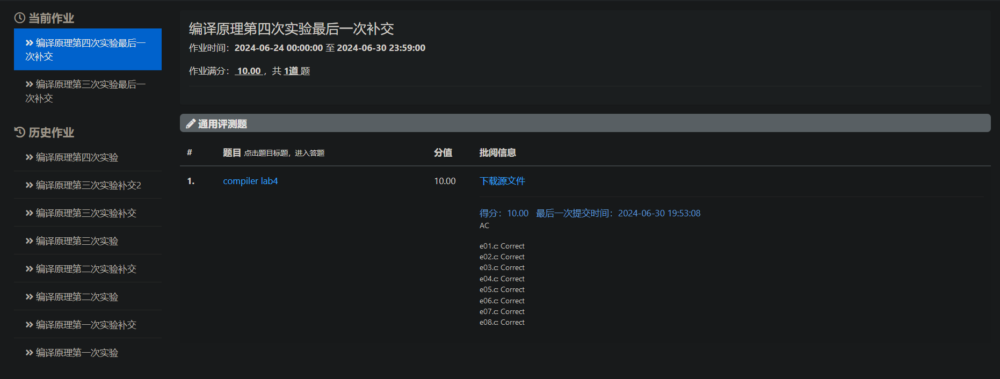

# 四代编译器

## 实验要求

四代编译器能够处理的文法如下所示。

- 关键字：`int`, `return`, `main`, `void`
  `if`, `else`, `while`, `continue`, `break`
- 标识符：符合 C89 标准的标识符（`[A-Za-z_][0-9A-Za-z_]*`）
- 常量：十进制整型，如 `1`、 `223`、 `10` 等
- 赋值操作符：`=`
- 运算符：
  - 一元运算符：`- ! ~`
  - 二元运算符：`+ - * / % < <= > >= == != & | ^ && ||`
- 标点符号：`; { } ( )`
- 语句：
  - 变量声明（多变量、初始化） `int a, b=111, c=1+3;`
  - 复杂表达式赋值语句  `a = (d+b&1)/(e!=3^b/c&&d); a = b+c;`
  - return 语句（可能为常数、变量、表达式） `return a+b; return func(a);`
  - 函数调用 `println_int(a+b);`
  - 条件语句 `if ( condition ) { ... }`
    `if ( condition ) { ... } else { ... }`
  - 循环语句 `while ( condition ) { ... }`
  - 循环控制语句 `continue; break;`
- 函数定义：
  - 不带参数 `int func(){...}` `void func() {...}`
  - 带参数（可能为常数、变量、表达式） `int func(int a, int b){...}` `void func(int a, int b){...}`
- 预置函数：在自定义函数外，还需支持对预置函数的调用。
  - `println_int(int a)` 与 C 语言中 `printf("%d\n", a)` 有相同输出

## 实验分工

- 学理论知识，探索技术路线。

- 重构符号表部分，支持 block scope 以及对应的 compound statement，允许作用域/block 的多重嵌套。 

- `if ( expression ) statement-true`
  
  `if ( expression ) statement-true else statement-false` -> `if ( expression ) statement-true else if ( expression ) statement-true else statement-false` -> ...
  
  `while ( expression ) statement` 具体实现上其实与 `if` 雷同。

- 样例测试、代码注释。

- 项目管理，文档撰写，资料查找，救火队长。

## 实验设计

关于符号表为什么要重构，以及是怎样重构的，具体参见当前文件夹下的 `README.md`，之后仅作简要介绍。

### 技术路线：

Source Code $\xrightarrow{Lexer}$ Tokens $\xrightarrow{Parser}$ Parse Tree (statements etc.) & AST (expressions) $\xrightarrow{Code\ Generator}$ Assembly Code

用 Flex 来写 Lexer，用 Bison 来写 Parser，Parser 与 Code Generator 相结合，对于一般语句可以直接生成代码，对于表达式会先构造抽象语法树（AST），再通过遍历结点生成代码。

### 源码结构：

代码的文件框架参考自 [Part 6: Variables](https://github.com/DoctorWkt/acwj/tree/master/06_Variables)，如下：

```Bash
src
├─ CMakeLists.txt                    # CMake 编译用
├─ CMakeLists-评测用.txt                    # CMake 评测用的简易版本，需改名
├─ MyBison.tab.c                    # ⚠ 自动生成，无须手动修改
├─ MyBison.tab.h                    # ⚠ 自动生成，无须手动修改
├─ MyBison.y        # Parser
├─ MyFlex.l        # Scanner/Lexer
├─ ast.cpp        # AST 结构
├─ build.sh                        # Build on Linux
├─ cases                        # 样例文件夹
│  ├─ e01.c
│  ├─ e02.c
│  ├─ e03.c
│  └─ e04.c
├─ codegen.cpp        # MIPS 代码生成，针对具体指令
├─ declare.h        # 头文件，声明各函数
├─ defs.h        # 头文件，定义一些复合类型数据
├─ gen.cpp        # 泛用代码生成
├─ lex.yy.c                        # ⚠ 自动生成，无须手动修改
├─ main.cpp        # 主函数，程序入口
├─ run.cmd                        # Build & Run on Windows
├─ stmt.cpp        # 语句相关代码生成
└─ symtab.cpp        # 符号表，变量、函数相关
```

©generated by [Project Tree Generator](https://woochanleee.github.io/project-tree-generator)

在从借鉴到改造 acwj 框架的过程中，各文件原本应有的良好的隔离性遭到了破坏，尤其 `codegen.cpp`, `gen.cpp`, `stmt.cpp` 在封装、调用上尚未打磨，分工多有重叠，有待改进。

这次稍微向“高内聚、低耦合”的目标靠拢，但还需要全面的改造（重构！重构！重构！）。

### 符号表

#### 局部变量（包括参数）

- `std::map<pair<string, int>, int> IDs;`

- `std::vector<symbol> IDtab;`

- `static int Index = 0;`       // 统计局部变量（不含参数）个数，便于栈操作。

- `static int Index_para = 0;`  // 统计参数个数，衔接 map 与 vector。

- `static int Index_scope = 0;` // 当前作用域序号，现在刚进入函数时为 1。

- `static int Scope_begin = 0;` // 当前作用域首个变量的序号-1，也即此前作用域变量总数

#### 函数

- `std::unordered_map<string, int> FUNCs;`

- `std::vector<symbol> FUNCtab`

- `static int Index_func = 0;`  // 统计函数个数。

#### 作用域

在 Parser 中维护一个 `scope`，进入每个 (block) scope 时自增，离开时自减。在每一作用域内声明的变量会附上 `scope` 的印记，这样做也允许了不同作用域下的同名变量，通过特定的 `findlocal` 函数实现了内层对外层的 Variable Shadowing (Name Hiding)，同时我们可以使同一作用域的各变量相靠近，优化了局部变量查找、删除等操作的性能。

### if statement & dangling else

```bison
%nonassoc THEN
%nonassoc ELSE

// 条件表达式为 0 => 跳转 （需要 if_ ）
// 否则正常执行（也就不需要 if_true_i 的标签）
if_statement : if_true %prec THEN { printf("\n$if_end_%d:\n", if_nested); if_nested --; }
             | if_true ELSE { /*printf("if_false_%d:\n\n\n", ++if_false_num);*/ } stmt { printf("\n$if_end_%d:\n", if_nested); if_nested --; /*printf("false\n");*/ }
;

// 统一按照跳转至 if_false_N 即可。
if_true      : IF '(' exp { if_num ++; if_nested = if_num; condition($3, 1, if_nested); } ')' { /*printf("true\n");*/ } stmt { printf("j $if_end_%d\n", if_nested); printf("\n$if_false_%d:\n", if_nested); }
;
```

注意，如果不采用以上的方式以实现某种结合的优先级，会出现移进/规约冲突，也即 Dangling Else Problem：

```bison
if_statement : IF '(' exp ')' stmt {}
             | IF '(' exp ')' stmt ELSE stmt { printf("false\n"); }
;


MyBison.y: warning: 1 shift/reduce conflict [-Wconflicts-sr]
MyBison.y: warning: shift/reduce conflict on token ELSE [-Wcounterexamples]
  Example: IF '(' exp ')' IF '(' exp ')' stmt . ELSE stmt
  Shift derivation
    if_statement
    `-> 29: IF '(' exp ')' stmt
                           `-> 31: if_statement
                                   `-> 30: IF '(' exp ')' stmt . ELSE stmt
  Reduce derivation
    if_statement
    `-> 30: IF '(' exp ')' stmt                                  ELSE stmt
                           `-> 31: if_statement
                                   `-> 29: IF '(' exp ')' stmt .
```

这里 ELSE 及其后语句的归属会有问题。

首先处理判断条件中的表达式，通过 `condition` 函数生成表达式求值、其与 0 进行比较以分支跳转到 `$if_false_N` 的汇编代码。紧跟着就是条件满足的 statement-true 的汇编代码，该部分的末尾需要跳转到标签 `$if_end_N`。之后要输出 `$if_false_N` 的标签，其下是 statement-false 的汇编代码，在末尾要输出`$if_end_N` 的标签。

此外，面对多重嵌套的 `if` 语句，我们需要得到每个 `if` 对应的 `$if_end_N` 以及 `$if_false_N` 标签的序号以方便跳转。一种方式是显式地维护一个栈以存放。

我们采用的方式是：

维护一个 `if_num` 以记录所有 `if` 的总数，在进入每个 `if` 语句时递增，这样符合”长远来看“标签序号的递增趋势。再维护一个 `if_nested` 以处理 `if` 嵌套的情形，类似于上节所说的 `scope`，进入 `if` 时赋值等同于 `if_num`，离开 `if` 时自减。这样就能模拟当 `if` 或 `else` 中有 `if` 语句时类似栈的情形，而不影响随着 `if` 总数增多的增长趋势，可以在 `if` 语句的末尾（也就是处理完中间的 `stmt` 之后）得到正确的 `$if_end_N` 和 `$if_false_N` 的标签号。

`while` 语句的操作与此雷同，在此略去。

### return statement

```bison
RETURN exp ';'       {
    return_statement($2);
    if (is_main == 1)
        exit_syscall();
    else if (is_main == 0)
        genfuncpostamble();
    }
```

这里 `return` 要注意区分返回时的两种情形。

## 实验结果



## 实验总结与反思

软工难，top-down 难，重构难。每次都觉得不破不立，要搞大破大立，回回推倒重来，断裂性有了，连续性丢了。

写文档难，容易写成碎碎念或者是剪报，写成让自己中意、让别人看懂难。

学语言难，语言特性千千万，文档、标准太纷繁。

协作难，孤狼不可取，群狼。。。“猛兽是单独的，牛羊则结队；野牛的大队，就会排角成城以御强敌了，但拉开一匹，定只能牟牟地叫。”


