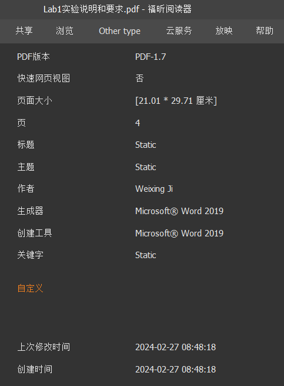
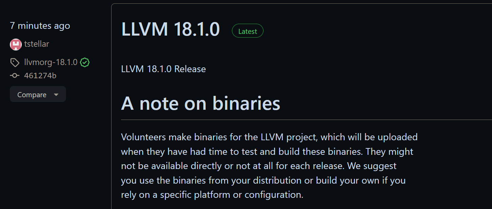
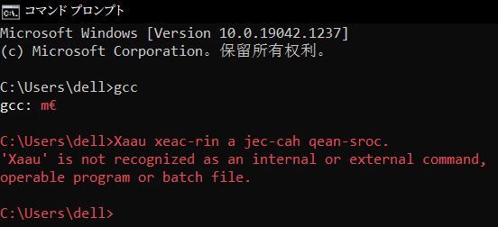
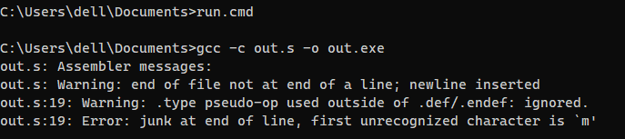

# Non-Stop!

## 前人之述

往年 BNU 编译原理实验：

### 2016 年

[GitHub - xuhongxu96/Compiler-Theory-Course: Compiler Theory Coursework - Beijing Normal University](https://github.com/xuhongxu96/Compiler-Theory-Course)

### 2019 年

[GitHub - xk-huang/c-minus-plus-plus: C Minus Plus Plus (c-++), a C Minus Compiler with C Features, also a course project for BNU Compiler Theory (2019)](https://github.com/xk-huang/c-minus-plus-plus)

### 2022 年秋：5 个实验

Teacher: Hua Luan

根据 [GitHub - Nofear12138/Principles-and-Techniques-of-Compilers: Principles and Techniques of Compilers in BNU 2022 Autumn](https://github.com/Nofear12138/Principles-and-Techniques-of-Compilers) 

其中明确指出了来源：[编译原理（2024年春季）](https://cs.nju.edu.cn/changxu/2_compiler/index.html)

[GitHub - HaoyuLu1022/Principles-of-Compilers: School experiment of the class "Principles of Compilers", 2022 Autumn](https://github.com/HaoyuLu1022/Principles-of-Compilers)

- 词法分析
- 语法分析
- 语义分析
- 中间代码生成
- 目标代码生成

[GitHub - TheThirdSanta/BNU-Compilation_Principle_FOR_13thGroup: BNU编译原理实验作业第13组](https://github.com/TheThirdSanta/BNU-Compilation_Principle_FOR_13thGroup)

这个给了 4 次的。

[GitHub - Lacrimosa-minor/BNUAIComplieExp: Experiment code of a team in BNU.](https://github.com/Lacrimosa-minor/BNUAIComplieExp)

这个给了 3 次的

### 2024 年春：

[GitHub - scatyf3/TinyCompiler](https://github.com/scatyf3/TinyCompiler)

[GitHub - Amigomust/Compiler_Lab: BNU 编译原理实验](https://github.com/Amigomust/Compiler_Lab)

[GitHub - elevengogogo/compiler_lab: 编译原理实验作业用于团队协作](https://github.com/elevengogogo/compiler_lab)

[GitHub - Amigomust/CMM: Compiler for bnu compilation principle experiment](https://github.com/Amigomust/CMM)

## 牢骚

### 始作俑者



  嗯，大改。

### 强者如斯


### 幽默更新



## 知识

### BNF Grammars

*context-free grammar* (CFG)

CFGs are also known as *phrase-structure grammars* or *type-3 languages*. Computer theorists and natural language linguists independently developed them at about the same time in the late 1950s. If you’re a computer scientist, you usually call them CFGs, and if you’re a linguist, you usually call them PSGs or type-3, but they’re the same thing.

The standard form to write down a CFG is *Backus-Naur Form* (BNF).

`1 * 2 + 3 * 4 + 5`

```BNF
<exp> ::= <factor>
      ! <exp> + <factor>
<factor> ::= NUMBER
      ! <factor> * NUMBER
```

Each line is a *rule* that says how to create a branch of the parse tree. In BNF, ::= can be read “is a” or “becomes,” and | is “or,” another way to create a branch of the same kind. The name on the left side of a rule is a *symbol* or *term*. By convention, all tokens are considered to be symbols, but there are also symbols that are not tokens.

## 偏题

### GCC

不是很懂 `gcc: m€` 是个什么。

```bash
Microsoft Windows [Version 10.0.19042.1237]
(c) Microsoft Corporation。保留所有权利。

C:\Users\dell>gcc
gcc: m€

C:\Users\dell>Xaau xeac-rin a jec-cah qean-sroc.
'Xaau' is not recognized as an internal or external command,
operable program or batch file.

C:\Users\dell>
```



#### [Assembler error at @function](https://stackoverflow.com/questions/40445227/mingw32-assembler-error-at-function)



```
        .text                           # Preamble code
.LC0:
        .string "%d\n"                  # "%d\n" for printf()
printint:
        pushq   %rbp
        movq    %rsp, %rbp              # Set the frame pointer
        subq    $16, %rsp
        movl    %edi, -4(%rbp)
        movl    -4(%rbp), %eax          # Get the printint() argument
        movl    %eax, %esi
        leaq    .LC0(%rip), %rdi        # Get the pointer to "%d\n"
        movl    $0, %eax
        call    printf@PLT              # Call printf()
        nop
        leave                           # and return
        ret

        .globl  main
        .type   main, @function
main:
        pushq   %rbp
        movq    %rsp, %rbp              # Set the frame pointer
                                        # End of preamble code

        movq    $2, %r8                 # %r8 = 2
        movq    $3, %r9                 # %r9 = 3
        movq    $5, %r10                # %r10 = 5
        imulq   %r9, %r10               # %r10 = 3 * 5 = 15
        addq    %r8, %r10               # %r10 = 2 + 15 = 17
                                        # %r8 and %r9 are now free again
        movq    $8, %r8                 # %r8 = 8
        movq    $3, %r9                 # %r9 = 3
        movq    %r8,%rax
        cqo                             # Load dividend %rax with 8
        idivq   %r9                     # Divide by 3
        movq    %rax,%r8                # Store quotient in %r8, i.e. 2
        subq    %r8, %r10               # %r10 = 17 - 2 = 15
        movq    %r10, %rdi              # Copy 15 into %rdi in preparation
        call    printint                # to call printint()

        movl    $0, %eax                # Postamble: call exit(0)
        popq    %rbp
        ret
```

The form of `.type` directive used is specific to the ELF object format. You'll need to figure out what, if anything, would be the equivalent for Window's PECOFF object format.

Ok so the solution was really simple: just comment the .type directive. The PECOFF doesn't need that. Now I'm able to compile and run just fine.

#### [gcc -c option flag](https://www.rapidtables.com/code/linux/gcc/gcc-c.html)

*TL;DR:*

```bash
gcc out.s -o out.o
gcc out.o -o out.exe
```

駄目（だめ）：

```bash
gcc out.s -o out.exe
```

gcc -c compiles source files ***without*** linking.

https://stackoverflow.com/questions/14724315/what-does-the-c-option-do-in-gcc


https://www.jianshu.com/p/d850844f31da

> 把Wegame和CF卸载了重启电脑就好了。这个问题困扰我一天，在百度搜各种方法。写篇小博客纪念一下，以后没CF了好好学习了。

幽默 CSDN [gcc报错16位应用程序解决办法](https://blog.csdn.net/weixin_45499478/article/details/107853438)

你应该与我一样是在windows上使用g++,gcc编译的程序,或者使用了mingw64的

然后请自己查看你的编译命令,差不多跟我一样:

```bash
gcc -O2 -Wall  -m64  -I./include -c main.c -o out/main.exe
```

那么,你的错误很常见也很明显: **去掉`-c`就好了**

* 去掉`-c`就好了
* 去掉`-c`就好了
* 去掉`-c`就好了

[mingw64 gcc g++ :不支持的 16 位应用程序](https://stackoverflow.com/questions/14724315/what-does-the-c-option-do-in-gcc)

### CMake

#### 命令行

```bash
mkdir build
cd build
cmake ..
cmake --build .
```

实验文档里给错了！！！`cmake –build .`不仅掉了一根，此`–`也非彼`-`。

#### 编译选项

> [](https://stackoverflow.com/posts/64147706/timeline)clang, but NOT gcc, has a `-Weverything` option which *appears* to include things such as `-Wpedantic`.

[What does the clang compiler's `-Weverything` option include and where is it documented?](https://stackoverflow.com/questions/64147706/what-does-the-clang-compilers-weverything-option-include-and-where-is-it-doc)

✨[Why should I always enable compiler warnings?](https://stackoverflow.com/questions/57842756/why-should-i-always-enable-compiler-warnings)✨

这些编译选项都是用来指定编译器在编译过程中应如何处理各种警告和错误。它们通常用于增强代码质量，确保代码符合最佳实践，并避免潜在的编程错误。下面是你提供的编译选项的详细解释：

1. **基本选项**:
   
   - `-pedantic` - 要求编译器遵循标准的严格解释，拒绝非标准的构造。
   - `-Wall` - 开启几乎所有的警告。
   - `-Wextra` - 开启额外的警告。
   - `-Wpedantic` - 同`-pedantic`。
   - `-Weverything` - 在Clang编译器中启用所有警告（不适用于GCC）。
   - `-Werror` - 将所有警告当作错误处理。

2. **特定警告处理**:
   
   - `-Wimplicit-fallthrough` - 警告switch语句中的隐式穿透（C++17的新特性）。
   - `-Wno-c++98-compat` - 不警告与C++98兼容性问题。
   - `-Wno-weak-vtables` - 不警告虚函数表可能过于弱（通常关联于类的第一个虚函数）。
   - `-Wno-padded` - 不警告结构体或类填充的字节。
   - `-Wno-shadow-field-in-constructor` - 不警告构造函数中的局部变量遮盖类成员。
   - `-Wno-shadow-uncaptured-local` - 不警告未捕获的局部变量遮盖。
   - `-Wno-shadow` - 不警告任何变量名遮盖。
   - `-Wno-global-constructors` - 不警告全局构造函数的使用。
   - `-Wno-exit-time-destructors` - 不警告在程序退出时运行的析构函数。

3. **禁用错误提示的警告**:
   
   - `-Wno-error=unused-parameter` - 未使用的参数不被视为错误。
   - `-Wno-error=unused-private-field` - 未使用的私有字段不被视为错误。
   - `-Wno-error=unreachable-code-break` - 不可达代码（如break后的代码）不被视为错误。

4. **其它禁用选项**:
   
   - `-Wno-unused-value` - 不警告未使用的值。
   - `-Wno-unused-parameter` - 不警告函数中未使用的参数。
   - `-Wno-switch-enum` - 不警告switch语句中未处理的枚举值。
   - `-Wno-signed-enum-bitfield` - 不警告枚举类型的位字段为有符号类型。
   - `-Wno-c++98-compat-pedantic` - 不警告对C++98的严格兼容问题。
   - `-Wno-c++98-c++11-compat-pedantic` - 不警告C++98到C++11的兼容问题。
   - `-Wno-c++20-compat` - 不警告对C++20的兼容问题。
   - `-Wno-nested-anon-types` - 不警告嵌套的匿名类型。
   - `-Wno-gnu-anonymous-struct` - 不警告GNU扩展的匿名结构体。
   - `-Wno-missing-prototypes` - 不警告缺少函数原型。
   - `-Wno-documentation` - 不警告文档相关的问题。
   - `-Wno-documentation-unknown-command` - 不警告未知的文档命令。
   - `-Wno-unused-const-variable` - 不警告未使用的const变量。
   - `-Wno-format-nonliteral` - 不警告格式字符串非字面量（例如变量）。
   - `-Wno-padded` - 不警告结构或类中为对齐添加的填充字节。

这些选项在高级C++开发中常见，帮助开发者避免常见错误，保持代码质量和可维护性。使用时需要根据实际使用的编译器和项目需求来适当选择和调整这些选项。如果使用的是GCC，需要移除或更改不支持的选项，如`-Weverything`等。**⚠️ ChatGPT 4 生成（待考）**

#### 切换编译器

**Option 1:**

You can set CMake variables at command line like this:

```objectivec
cmake -D CMAKE_C_COMPILER="/path/to/your/c/compiler/executable" -D CMAKE_CXX_COMPILER "/path/to/your/cpp/compiler/executable" /path/to/directory/containing/CMakeLists.txt
```

See [this](http://www.cmake.org/cmake/help/v2.8.12/cmake.html#opt:-Dvar:typevalue) to learn how to create a CMake cache entry.

***

**Option 2:**

In your shell script `build_ios.sh` you can set environment variables `CC` and `CXX` to point to your C and C++ compiler executable respectively, example:

```javascript
export CC=/path/to/your/c/compiler/executable
export CXX=/path/to/your/cpp/compiler/executable
cmake /path/to/directory/containing/CMakeLists.txt
```

***

**Option 3:**

Edit the CMakeLists.txt file of "Assimp": Add these lines at the top (must be added before you use `project()` or `enable_language()` command)

```swift
set(CMAKE_C_COMPILER "/path/to/your/c/compiler/executable")
set(CMAKE_CXX_COMPILER "/path/to/your/cpp/compiler/executable")
```

See [this](http://www.cmake.org/cmake/help/v2.8.12/cmake.html#command:set) to learn how to use `set` command in CMake. Also [this](http://www.cmake.org/Wiki/CMake_Useful_Variables) is a useful resource for understanding use of some of the common CMake variables.

***

**Here is the relevant entry from the official FAQ: <https://gitlab.kitware.com/cmake/community/wikis/FAQ#how-do-i-use-a-different-compiler>**

[How do you set CMAKE_C_COMPILER and CMAKE_CXX_COMPILER for building Assimp for iOS?](https://stackoverflow.com/questions/11588855/how-do-you-set-cmake-c-compiler-and-cmake-cxx-compiler-for-building-assimp-for-i)

Clang:

```bash
SET(CMAKE_C_COMPILER "/usr/bin/clang")
SET(CMAKE_CXX_COMPILER "/usr/bin/clang++")
```

GNU:

```bash
SET(CMAKE_C_COMPILER "/usr/bin/gcc")
SET(CMAKE_CXX_COMPILER "/usr/bin/g++")
```

#### 检查编译器

A reliable check is to use the [`CMAKE_<LANG>_COMPILER_ID`](https://cmake.org/cmake/help/latest/variable/CMAKE_LANG_COMPILER_ID.html) variables. E.g., to check the C++ compiler:

```php
if (CMAKE_CXX_COMPILER_ID STREQUAL "Clang")
  # using Clang
elseif (CMAKE_CXX_COMPILER_ID STREQUAL "GNU")
  # using GCC
elseif (CMAKE_CXX_COMPILER_ID STREQUAL "Intel")
  # using Intel C++
elseif (CMAKE_CXX_COMPILER_ID STREQUAL "MSVC")
  # using Visual Studio C++
endif()
```

[In CMake, how can I test if the compiler is Clang?](https://stackoverflow.com/questions/10046114/in-cmake-how-can-i-test-if-the-compiler-is-clang)

```cmake
if ("${CMAKE_CXX_COMPILER_ID}" STREQUAL "GNU")
  set(Options
      -Wall -Wextra -pedantic -Werror
      -Wno-unused-value
      -Wno-unused-parameter
      -Wno-switch-enum
  )
elseif ("${CMAKE_CXX_COMPILER_ID}" STREQUAL "Clang")
  set(Options
      -Wall -Wextra -Wpedantic -Weverything -Werror
      -Wno-c++98-compat -Wno-weak-vtables -Wno-padded -Wno-shadow-field-in-constructor
      -Wno-shadow-uncaptured-local -Wno-shadow -Wno-global-constructors -Wno-exit-time-destructors
      -Wno-switch-default
      -Wno-shadow-field
      -Wno-error=unused-parameter
      -Wno-error=unused-private-field
      -Wno-error=unreachable-code-break
      -Wno-unsafe-buffer-usage
      -Wno-unused-value
      -Wno-unused-parameter
      -Wno-switch-enum
      -Wno-signed-enum-bitfield
      -Wno-c++98-compat
      -Wno-c++98-compat-pedantic
      -Wno-c++98-c++11-compat-pedantic
      -Wno-c++20-compat
      -Wno-nested-anon-types
      -Wno-gnu-anonymous-struct
      -Wno-missing-prototypes
      -Wno-documentation
      -Wno-documentation-unknown-command
      -Wno-weak-vtables
      -Wno-unused-const-variable
      -Wno-format-nonliteral
      -Wno-global-constructors
      -Wno-exit-time-destructors
      -Wno-padded
  )
endif()
```

这样，你的CMake配置会根据不同的编译器适应不同的编译选项。

#### Clang 版本问题

> Before clang 16.0 I was able to compile all my projects using -Weveything without problems, fixing my code and paying attention to the (useful) warnings that this option gave. However, it seems that the -Wunsafe-buffer-usage was added in version 16 (my system updated to it recently) and then compiling any project is impossible without getting a huge list of useless warnings about any pointer being used, see minimal example below...

> Setting `-Wno-unsafe-buffer-usage` works, but it is an ugly solution. It adds clutter to a Makefile and feels like cheating.

[How to fix code to avoid warning -Wunsafe-buffer-usage](https://stackoverflow.com/questions/77017567/how-to-fix-code-to-avoid-warning-wunsafe-buffer-usage)

[-Wunsafe-buffer-usage] Initial commit - Transition away from raw buffer accesses.](https://reviews.llvm.org/D137346)

[[-Wunsafe-buffer-usage] Introduce the `unsafe_buffer_usage` attribute](https://reviews.llvm.org/D138940)

```bash
clang version 14.0.5 (Fedora 14.0.5-2.fc36)
Target: x86_64-redhat-linux-gnu
Thread model: posix
InstalledDir: /usr/bin
```

```bash
-- The C compiler identification is Clang 14.0.5
-- The CXX compiler identification is Clang 14.0.5
```

暂未上新，留待后用。

[How to install the latest stable Clang on Fedora?](https://unix.stackexchange.com/questions/720265/how-to-install-the-latest-stable-clang-on-fedora)

### Multiple Definition

如果多个代码文件包含了同一个头文件，并且该头文件中定义了变量、函数等实体，而不仅仅是声明它们，那么在链接这些代码文件生成最终的可执行文件或库时，确实可能会遇到“multiple definition of...”错误。这是因为每个包含了该头文件的源文件都会尝试定义同一实体，从而在链接阶段造成冲突。

为了避免这种情况，通常采取以下策略：

1. **仅在头文件中声明变量和函数**：头文件应该用于声明变量（使用`extern`关键字）和函数原型，而将定义（实际的变量分配和函数实现）放在一个单独的源文件（.c或.cpp文件）中。这样，无论头文件被包含多少次，定义总是只存在一份。

2. **使用头文件保护**：为了避免头文件内容在同一个编译单元中被包含（插入）多次，可以使用预处理宏来防止这种情况。通常的做法是在头文件的开始使用`#ifndef`、`#define`和`#endif`指令来检查某个唯一的宏是否已定义，如果未定义，则定义它，并允许头文件内容的包含。如果该宏已定义，则跳过内容的包含。这称为“包含卫士”（include guard）或“头文件保护”。

例如：

```c
// Example.h
#ifndef EXAMPLE_H // 如果EXAMPLE_H未定义，则执行下面的代码
#define EXAMPLE_H

// 在这里声明函数和全局变量（使用extern）
extern int globalVariable;
void functionDeclaration();

#endif // EXAMPLE_H
```

然后，在一个源文件中定义这些变量和函数：

```c
// Example.c
#include "Example.h"

int globalVariable = 0; // 定义变量
void functionDeclaration() {
    // 函数实现
}
```

这样做可以确保即使多个源文件包含同一个头文件，每个变量或函数的定义只会出现一次，在链接时不会出现多重定义错误。

**⚠️ ChatGPT 4 生成（待考）**

#### 不治之症

[Assembly multiple definition](https://stackoverflow.com/questions/32855825/assembly-multiple-definition)

[Linking an assembler program: error "undefined reference to \`printf`"](https://stackoverflow.com/questions/34374591/linking-an-assembler-program-error-undefined-reference-to-printf)

[usr/bin/ld: cannot find -l\<nameOfTheLibrary>](https://stackoverflow.com/questions/16710047/usr-bin-ld-cannot-find-lnameofthelibrary)

[Error: /usr/bin/ld: final link failed: File truncated](https://stackoverflow.com/questions/20017091/error-usr-bin-ld-final-link-failed-file-truncated)

计算机系统导论lab1中的"multiple definition of", "first defined here"...

### Pandoc

#### Package Soul Error (TODO)

Package Soul Error, when using the soul package (seems default in Pandoc) **together with ctex**, and when I use 删除线 ~~Latin OK, CJKV not.~~

`\usepackage{xeCJKfntef}`
`$\text{\sout{日式转写：Shodai Konpa}}$`

If I don't use `\text{}` outside, CJKVs just disappear (maybe cuz of Maths fonts)

If I use `\text{}`, Markdown WYSIWYG just goes wrong.


https://github.com/jgm/pandoc/issues/9019

This is a well known problem with `soul`, try the `soulutf8` package

https://tex.stackexchange.com/questions/536326/trouble-with-soul-and-utf8
